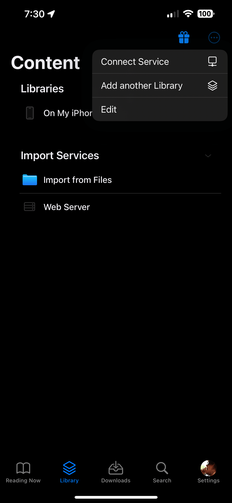

import { Callout } from 'nextra/components'

<Callout type="warning" emoji="⚠️">
  iOS requires HTTPS for remote connections. That means if you want to access your Kavita instance remotely you need to setup a reverse proxy and use SSL. 
</Callout>

## Setup

**First of all make sure Kavita is updated**

1. Access your Kavita user settings dashboard.
2. Switch to the "3rd Party Clients" tab.
3. Copy your OPDS URL.
4. Once you have your URL copied, open Panels.
5. Go to the "Library" screen.
6. Tap the 3-dot menu in the top right corner.

7. Select the "Connect Service".
8. Pick "OPDS" from the screen that shows up.
9. Fill in your server name into "Alias"
10. Paste the URL you copied into the 'host' field
11. Do NOT fill in a username or password. Authentication is handled by your API key that is in your URL.
12. If you are running Kavita on a different port you need to remove the port 'IP:####' from your URL and add the port to the 'Port' setting.
13. Tap 'Apply' in the top right corner.