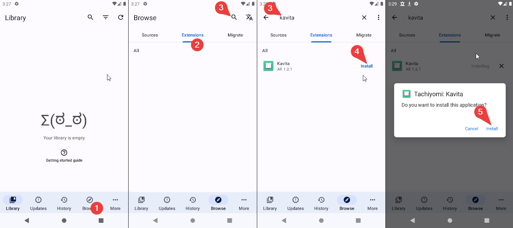
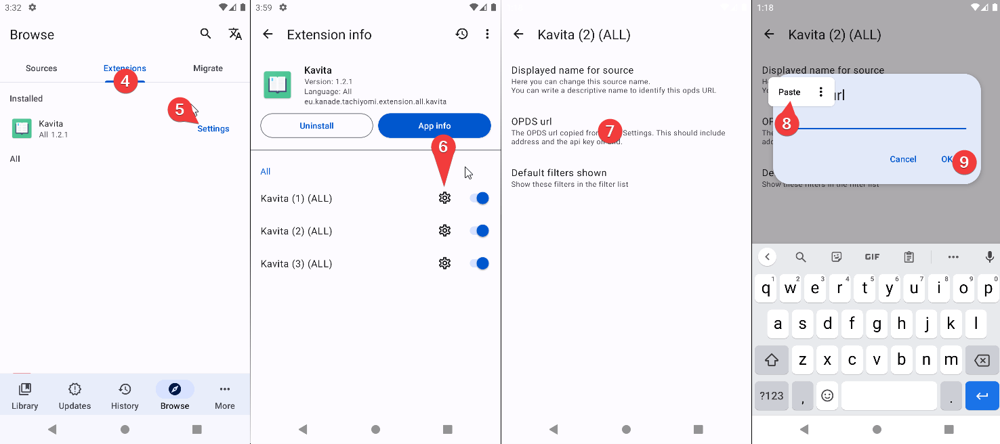
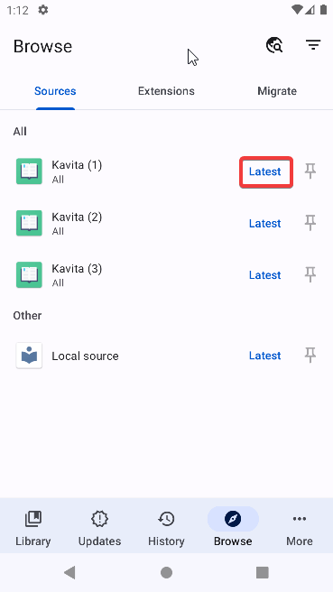

import { Callout } from 'nextra/components'

<Callout type="warning" emoji="⚠️">
  Currently, we only support the official Mihon app and Komikku.
  
  Forks that are confirmed to work: TachiyomiSY.
</Callout>

## Add Kavita extension repository

You can click on this button from your Android to automatically add the repo:

Otherwise,

1. In Mihon, go to "More" > "Settings" > "Browse" > "Extension repos"
2. Click on "Add"
3. Input this URL: `https://raw.githubusercontent.com/Kareadita/tach-extension/repo/index.min.json`

## Installation

**First of all make sure Kavita is updated.**

1. After that, after opening Mihon, go to Browse in the lower nav.
2. Select the Extensions tab at the top of the screen.
3. Now you can either scroll down until you find it or hit the search icon and write Kavita in it. (Make sure to toggle "Multi" in the languages to see the extension)
4. Once you find or search tap install.
5. In the confirmation menu hit install again.

**Make sure to click "Trust" on the extension once installed.**

## Setup

To make the extension link with your Kavita instance we need the OPDS URL.
The steps to get the OPDS URL are:

Access your Kavita instance from your web browser and log in
1. Access your Kavita user dashboard
2. Switch to "3rd Party Clients" tab
3. Copy the text under the OPDS URL

**Once the  OPDS URL is obtained open Mihon**
4. Go back to the Mihon extensions tab
5. Tap Kavita
6. Tap the gear icon in one of the sources. (sources explained in customization)
7. Tap OPDS URL setting
8. Paste your OPDS URL (If your OPDS URL address differs from your Kavita address, change it.)
9. Tap ok
10. Restart Mihon
11. Browse your library 

## Usage
### Browse all your libraries

### Browse recently added

 
 

## Customization

Once installed the user has access to 3 sources. This means you can have access to 3 different Kavita servers. 
On each source, you can set up different OPDS URLs and different filter preferences. By default, these are differentiated with a number. 1, 2 and 3. You can change each identifier with your own name. 

<Callout type="warning" emoji="⚠️">
  You can only add different domains as instances—adding the same domain twice will cause both sources to break.
</Callout>

### To change the name of the source

Follow the same process used for OPDS but tap "Source Display Name" instead.

### Advanced customization
The extension offers extensive customization. There is no breaking settings so you're free to play around with them. Here is a description of each option.

#### Tags Grouping
**This is only for forks. This does not work with the original Mihon.**
This will turn your genres/tags list into organized categories, like so: 
 => 
<small>(left: disabled ; right: enabled)</small>

#### Dynamic Cover Updates
Everytime your title is refreshed, it will check what Volume/Issue you're currently reading and sync the cover.

#### EPUB Visibility
This is disabled by default because Kavita Epubs can't be read in Mihon, but you can enable it if needed here.

#### Reading List: Display Release Date
When enabled, the extension will display the original **Release Date** of the chapter instead of the date it was added to your Kavita server.

#### Chapters: Display Release Dates
When enabled, the extension will display the original **Release Date** for individual chapters instead of the date the chapter was added to your Kavita server. This is useful for accurate chronological sorting.

#### Chapter Title Format
This allows you to customize the title shown for each chapter using special format codes based on the metadata available in Kavita.
 **⚠️ Use variables without curly braces, e.g., `$CleanTitle` instead of `${CleanTitle}`.** Available variables:
`$Type` - Chapter/Episode/Volume/Issue/Special
`$No` - Chapter number
`$Title` - Original chapter title
`$CleanTitle` - Custom-cleaned chapter title (default)
`$Pages` - Number of pages
`$Size` - File size
`$Volume` - Volume number (If available)
`$SeriesName` - Series name
`$LibraryName` - Library name
`$Format` - File format (CBZ, PDF, etc.)
`$Created` - Creation date
`$ReleaseDate` - Release date

#### Scanlator Format
Similar to the chapter title, this lets you customize the text displayed in the Scanlator field using available metadata variables.
 **⚠️ Use variables without curly braces, e.g., `$CleanTitle` instead of `${CleanTitle}`.** Available variables:
`$Type` - Chapter/Episode/Volume/Issue/Special
`$No` - Chapter number
`$Title` - Original chapter title
`$CleanTitle` - Custom-cleaned chapter title (default)
`$Pages` - Number of pages
`$Size` - File size
`$Volume` - Volume number (If available)
`$SeriesName` - Series name
`$LibraryName` - Library name
`$Format` - File format (CBZ, PDF, etc.)
`$Created` - Creation date
`$ReleaseDate` - Release date

#### Allowed Libraries on Latest/Popular Feeds & Suggestions
Use this setting to filter content on the main browsing tabs. Only content from the **selected** Kavita libraries will appear in the **Latest**, **Popular** feeds. For Komikku, this will be applied to **Suggestions** as well.

#### Allowed Libraries in Search
Use this setting to filter content when performing a global search. Only content from the **selected** Kavita libraries will return results when searching within the extension.

## Sync Progress with Kavita
Kavita has progress sync with Mihon. It will automatically mark completed chapters as read in both apps. It does not sync page progress, it only syncs when a chapter is complete.

To activate tracking go to settings > Tracking and click on Kavita at the bottom.

After activating it will appear with the rest of the trackers on your manga page. Make sure it shows it is active otherwise, it will not sync.

