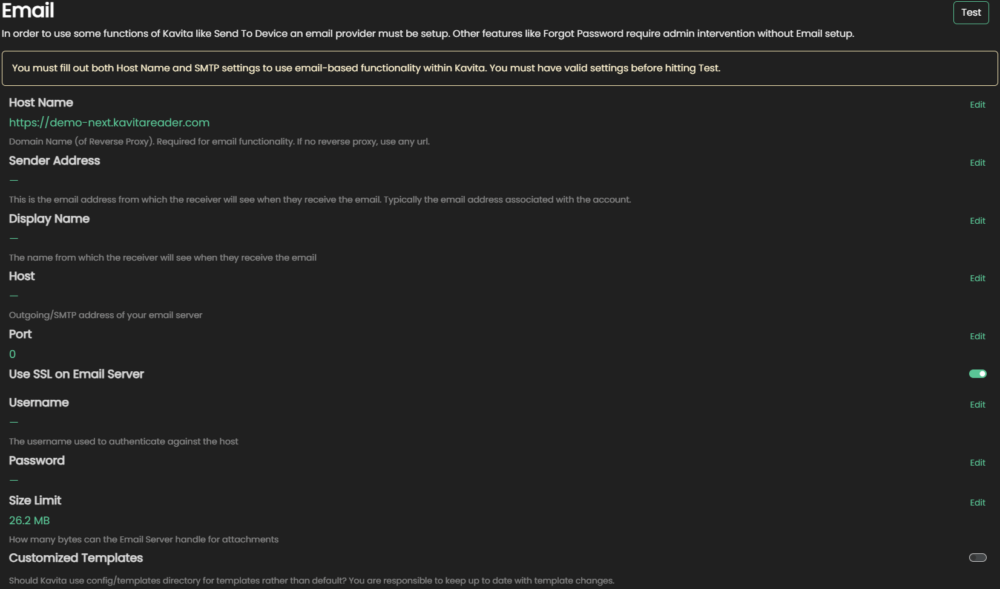

import { Callout } from 'nextra-theme-docs'

# Email Tab 

In this tab you can configure the email service Kavita uses for Send To device, User registration, and Forgot Password. 

<Callout type="warning" emoji="⚠">
  As of version 0.7.13.0 Kavita no longer sends emails using the built in account. This will stop working at a future date.
</Callout>

<Callout type="info" emoji="ℹ">
  You no longer need to use the Kavita-Email external program. This functionality has been built directly into Kavita.
</Callout>

You need to configure an email server in order for you to use the Invite by email, forget password and send to device functionality.

### Migrating from Kavita-Email
To use the new email server built into the main applcation of Kavita going forward you can just transfer your settings from Kavita-Email.

These are the same exact settings you were using already, just not built-in. 

### Gmail users
You'll need to setup an "App Password" to use the email service with your existing email account. 

[How to create a gmail app password](https://support.google.com/accounts/answer/185833?hl=en)
