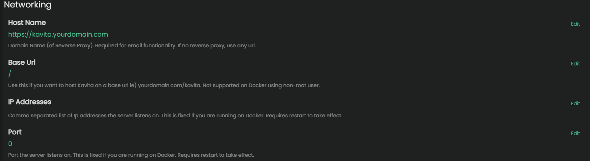
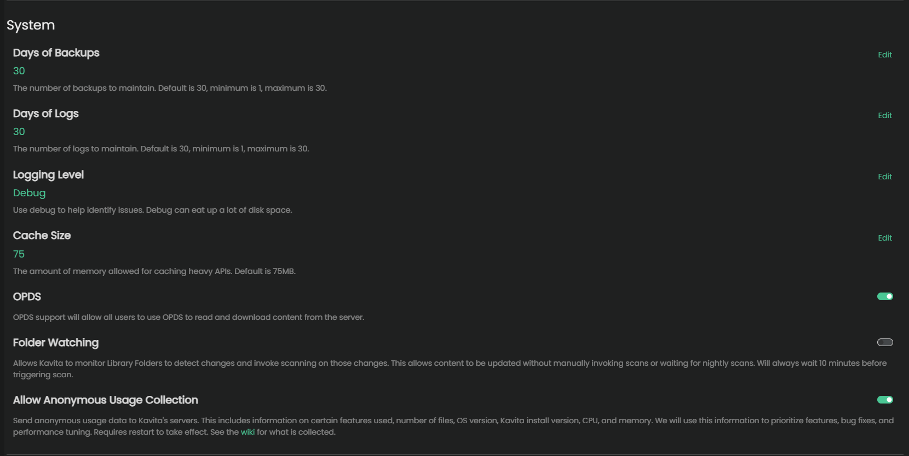
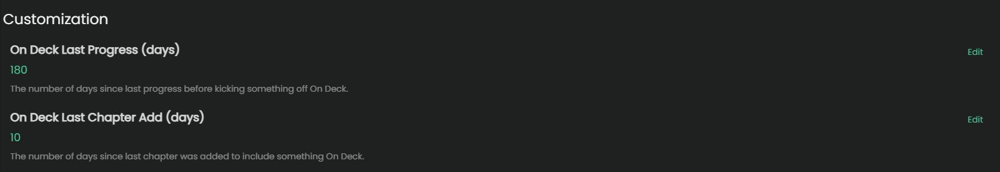

import { Callout } from 'nextra/components'

# Server Settings - General 

## Networking Section

### Host Name

If you are using a reverse proxy with Kavita, you can set this field so that Kavita uses your domain name. This will show up in the user's OPDS URL pages and any emails your server sends out, if configured to do so. 

### Base URL

<Callout type="info" emoji="ℹ️">
  This setting can not be changed if you are running the docker image as a non-root user. 
</Callout>

Default: `/`

Base URL must start and end with `/`  
Use this if you want to host Kavita in a sub-folder. Most commonly used in sub-folder reverse proxy setups.

Example:  
Setting the base URL to `/kavita/` would then make your URL to access the service: `http://[yourip]:[port]/kavita/`

### IP Address

This is the IP address that Kavita will bind to. By default, Kavita will bind to all available IP addresses. If you want to bind to a specific IP address, you can set it here.

This setting is disabled on Docker installations. You can control the IP address through the Docker run command or compose file if needed.

### Port

<Callout type="info" emoji="ℹ️">
  This setting can not be changed if you are running the docker image as a non-root user. 
</Callout>

Default: `5000`

Changes to the port require a manual restart of the server to take. Docker users should configure the port through their compose file / run command instead of changing it within Kavita. 

## System Section

### Days of Backups

Default: `30` 

The number of days worth of backups to maintain. The minimum is 1, maximum is 30.

### Days of Logs

Default: `30` 

The number of days worth of logs to maintain. The minimum is 1, maximum is 30.

### Logging Level
For selecting the granularity of the logs. Most commonly used in helping diagnose problems or bugs.

Default: `Information`

<Callout type="warning" emoji="⚠️">
  Changing this setting to `Debug` or higher can consume a large amount of disk space on an active server. Only change the log level if asked by support staff! 
</Callout>

### Cache Size

Default: `75`

Amount of RAM to allocate for keeping heavily used API's in memory. Keep in mind that using dynamic filters has a higher chance of not getting cached due to the nature of how they work. 

### OPDS support

Default: `Enabled`

System wide setting to turn on or off OPDS for the entire server. See this [page](../features/opds.mdx) for how it works.

### Folder Watching

Default: `Disabled`

You can turn on or off the folder monitor system-wide here. Allows Kavita to monitor Library Folders to detect changes without manually invoking scans or waiting for nightly scans.

<Callout type="info" emoji="ℹ️">
  The folder monitor only triggers once every 10 minutes before processing changes. That means changes won't be instant. 
</Callout>

### Allow Anonymous Usage Collection

<Callout type="info" emoji="ℹ️">
  The data collection task will only run after 24 hours has passed in order to give you time to opt-out.
</Callout>

By default, Kavita will collect anonymous usage data to help guide the development team into making decisions around features. This includes information on certain features used, number of files, OS version, Kavita install version, CPU, and memory.

You can opt out at any time by turning off this setting. All data is anonymized and contains **no information about your filenames or IP**.

The Kavita team actively uses this data to help design the UX and plan enhancements. If you choose to remain opted-in, **thank you** ❤. It greatly helps in the design and planning effort when trying to look for new features to add. You can see exactly what data we collect in the [source code](https://github.com/Kareadita/KavitaStats/tree/main/KavitaStats/Entities/V3).

Check the [FAQ](../../troubleshooting/faq.mdx#q-does-kavita-collect-any-data-on-me) to see an example of submitted data. 

## Customization Section

### On Deck Last Progress (days)

Default: `30`

The number of days since last the user has made any reading progress before removing the series from the `On Deck` section.

This only applies to the built-in "On Deck" card. It will not apply to custom filters.

### On Deck Last Chapter Add (days)

Default: `7`

An adjustable number of days before removing a series from "On Deck". Setting this to a higher value will prevent the series from falling off with inactivity. 