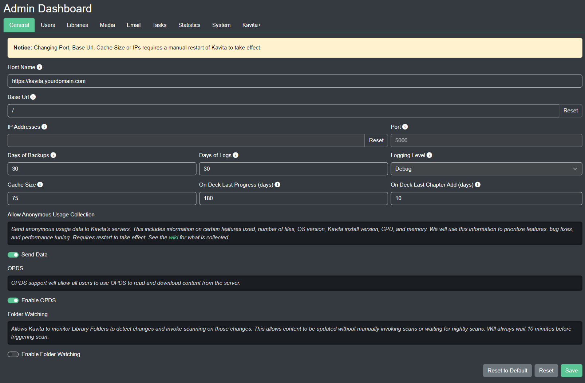

import { Callout } from 'nextra-theme-docs'

# General Tab 

## Base URL

<Callout type="info" emoji="ℹ️">
  This setting can not be changed if you are running the docker image as a non-root user. 
</Callout>

Default: `/`

Base URL must start and end with `/`  
Use this to if you want to host kavita in a sub-folder. Most commonly used in sub-folder reverse proxy setups.

Example:  
Setting base URL to `/kavita/` would then make your URL to access the service: `http://[yourip]:[port]/kavita/`

## Port

<Callout type="info" emoji="ℹ️">
  This setting can not be changed if you are running the docker image as a non-root user. 
</Callout>

Default: `5000`

Changes to the port require a manual restart of the server to take. Docker users should configure the port through their compose file / run command instead of changing it within Kavita. 

## Logging Level

Default: `Information`

For selecting the granularity of the logs. Most commonly used in helping diagnose problems or bugs.

<Callout type="warning" emoji="⚠️">
  Changing this setting to `Debug` or higher can consume a large amount of disk space on an active server. Only change the log level if asked by support staff! 
</Callout>

## Days of Backups

Default: `30` 

The number of backups to maintain. Minimum is 1, maximum is 30.

## Cache Size

Default: `75`

Amount of RAM to allocate for keeping heavily used API's in memory. Keep in mind using that using dynamic filters have a higher chance of not getting cached due to the nature of how they work. 

## On Deck Last Progress (days)

Default: `30`

The number of days since last the user has made any reading progress before removing the series from the `On Deck` section.

This only applies to the built-in "On Deck" card. It will not apply to custom filters.

## On Deck Last Chapter Add (days)

Default: `7`

Adjustable number of days before removing a series from "On Deck". Setting this to a higher value will prevent series from falling off with inactivity. 

## Anonymous Stats Collection

By default, Kavita will collect anonymous usage data on your installation. This includes information on certain features used, number of files, OS version, Kavita install version, CPU, and memory. Stats collection will run after 24 hours in order to give you time to opt out. 

You can opt out at any time by turning off "Send Data" from the Admin Dashboard. All data is anonymized and contains **no information about your filenames or IP**.

The Kavita team actively uses this data to help design the UX and plan enhancements. If you chose to remain opted-in, thank you. It really helps in the design and planning effort. You can see exactly what data we collect [here](https://github.com/Kareadita/KavitaStats/blob/main/KavitaStats/Entities/StatRecord.cs).

Check the [FAQ](https://wiki.kavitareader.com/en/faq#q-does-kavita-collect-any-data-on-me) to see an example of submitted data. 

## Enable OPDS support

Default: `Enabled`

You can enable OPDS for your Server here. See this [page](https://wiki.kavitareader.com/en/guides/settings/opds) for how it works.

## Folder Watching

Default: `Disabled`

You can turn on or off the folder monitor system wide here. Allows Kavita to monitor Library Folders to detect changes without manually invoking scans or waiting for nightly scans.

<Callout type="info" emoji="ℹ️">
  The folder monitor only triggers once every 10 minutes before processing changes. That means changes won't be instant. 
</Callout>