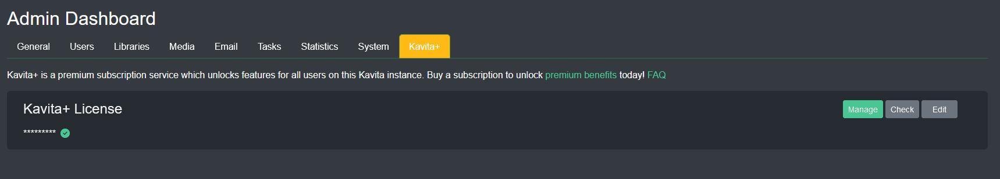

import { Callout } from 'nextra-theme-docs'

## Kavita+ Tab

From this screen you can manage your servers Kavita+ license.

Clicking 'Manage' will take you to the stripe login page.

Clicking 'Check' will verify your license if your server has been offline for a while and couldn't reach the K+ server.

When putting in your license key and email you have the option of adding your Discord User ID. This will give you the verified K+ role in the discord server. 

Verified K+ users have access to special channels in the discord and are often asked to help shape the future of Kavita. 

### Resetting your license

You can now reset your own license if you want to move installs to a different machine. This avoids having to contact the dev in order to change your keys. 

<Callout type="info" emoji="ℹ️">
  You can only have 1 server with an active license at a time.  
</Callout>

To reset your license, click 'edit' and then fill out your `License Key` and `Email` you used to sign up. Pressing the 'Reset' button will remove your license file. It may take up to 10 seconds for this to process.

Once the license is removed from the existing instance you can register your key on another instance. This allows you to self-service reset as needed. 