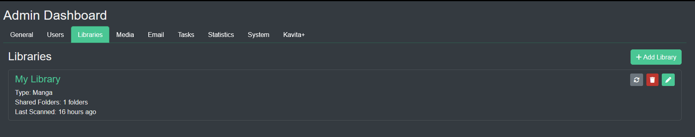
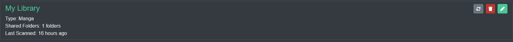
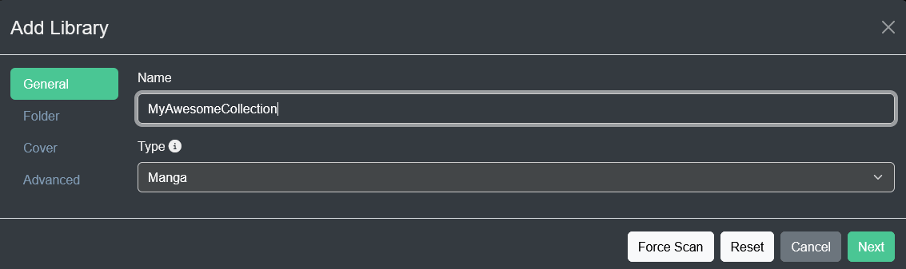
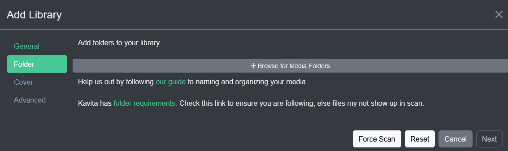
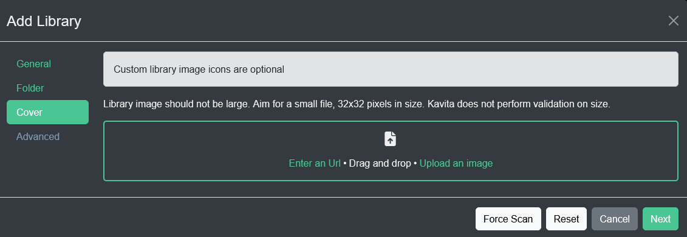
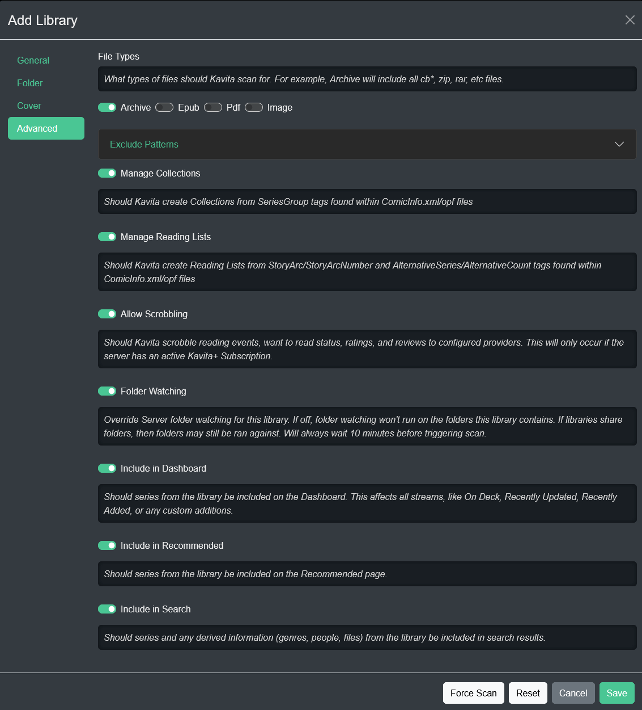
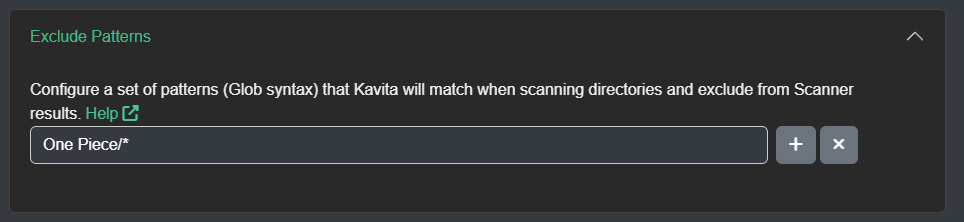

import { Callout } from 'nextra/components'

# Libraries Tab

> The libraries tab is how you make your own content available to your users.

## Managing Libraries

The name of the library is highlighted in green. Clicking on it will send you to the series view inside the library.

#### Important Fields

##### Type
Type is the powerhouse of a Library. It will determine how the Scanner and UI are customized. Selecting the correct library will make an important difference in how Kavita works for you.

###### Book
Book is a general-purpose library type. 

###### Comic
Comic is designed with strict metadata adherence to Comic Vine in mind and is for those that are heavily using Mylar and CBL Project. 

- Series name is formulated: `Series Name (Volume number)` where `Volume number` is expected to be the starting year of the run.
- Does not render Volume tab (TPBs not supported)
- See [Mylar guide](./guides/3rdparty/mylar/)
- Supports Kavita+ features: Metadata
- Metadata sites/adherence (ComicVine/Metron/etc) dictate that TBPs and Annuals are their own series. 

###### Comic (Flexible)
This is the earliest version of Comics in Kavita and is much more flexible in representation. It is a good choice if you are not actively going to use CBLs.

- Series name is derived from parsing/metadata
- Volume, TPBs, and Special tab all supported
- Cannot represent multiple series of different runs separately without user intervention (attaching year to series name)
- Supports flexible grouping like having TBPs and issues mixed or annuals as specials
- Supports Kavita+ features: Metadata

###### Image
This is a custom built library for Loose Image libraries. 

- Only supports image files
- Can parse Volume and chapter number (using Manga naming conventions) from Folders for grouping
- Series name is assumed to be the top level folder
- Does not support Specials
- Does not support any file-based metadata (sidecar files)
- Supports Kavita+ features: Metadata, Scrobbling

###### Light Novels
Light novels are Japanese books (usually in a series) that use the Volume nomenclature. This is essentially Book library type with some extra logic for Volumes. 

- Supports Kavita+ features: Metadata, Scrobbling, Reviews, Recommendations

###### Manga
Manga supports manga/webtoon type of material. These generally stick to volume/chapter groupings. 

- Supports Kavita+ features: Metadata, Scrobbling, Reviews, Recommendations
- Supports Specials and Volumes

**Note:** Comic library type assumes volume is tagged as year or some other series unique identifier in the volume field to allow multiple series to exist with the same name in the library it also adheres to the data sources for comics method of handling specials/trades/annuals as separate entities.  
Comic (Flexible) has a similar presentation to the Manga library and is more versatile for those wishing to customize metadata to group series with singles/TPBs/Annuals all in one Kavita series.

## Adding Libraries

To add a library click on the "Add Library" button

### General

Fill out the name you want your library known by. This is what you will select when adding libraries to users. 

Select the type of library you are trying to create from the dropdown, then press next.

<Callout type="error" emoji="️⚠️">
  Library type is an important field, read about them [above](#book).
</Callout>

### Folders

Pick the folders you want added to your library using the folder picker. A library can contain more than 1 folder. This is useful if you have your files spread out across multiple hard drives or network shares. It is not recommended to directly select a series folder.

<Callout type="info" emoji="🐳">
  Docker users: If you don't see your mounted folder at first make sure to check `/` for it. 
</Callout>

### Library Cover

This step isn't required but allows you to upload a small cover image to use to customize the icon when the library is displayed. 

Using too large of a file here can slow down the server. 32x32 is recommended

### Advanced Settings

#### File types

This controls what kind of files the scanner will look for when adding to the library. Use this for example if you want to turn off PDF's from showing up in a comic library. Or if you're having cover.jpg's creating a new series, you can turn off 'image'. 

#### Exclude Patterns
A set of [Glob syntax](https://github.com/dazinator/DotNet.Glob/blob/develop/README.md#patterns) that will ignore scanning/processing of files and folders. 

> In the example above, any file within a folder named One Piece from the library root will be ignored.

More advanced customization of excludes is accomplished by [glob patterns](https://github.com/dazinator/DotNet.Glob/blob/develop/README.md#patterns)

* Patterns without the forward-slash ' /' character (e.g. *.cbz) match filenames
* Patterns with the forward-slash '/' character (e.g. somedir/*) match directory and file patterns
* `**/folder/*` will ignore the folder at any depth in a path

#### Manage Collections

Set to create Collections from SeriesGroup tags found within ComicInfo.xml or epub metadata. 

#### Manage ReadingLists

Set to create Reading Lists from StoryArc/StoryArcNumber and AlternativeSeries/AlternativeCount tags found within ComicInfo.xml or epub metadata.

#### Allow Scrobbling 
<Callout type="info" emoji="ℹ️">
  This feature requires an active Kavita+ subscription to use. 
</Callout>

This controls if your users can scrobble series that are found in this library. 

#### Folder Watching
<Callout type="warning" emoji="⚠️">
  Folder watching takes 10 minutes to trigger once a change is detected.
</Callout>
Folder watching is enabled by default and watches each folder of a given library for modifications. 

Folder watching lets Kavita know when a file has been added or modified in your library and update it in your Kavita instance.
When files are added (loose images or non-supported extensions are ignored), renamed, deleted, etc, Kavita takes note and queues a Scan.

Overrides server folder watching for this library. If off, folder watching won't run on this library. If libraries share folders, then folders may still be run against.

<Callout type="info" emoji="🐳">
  Docker on Windows over WSL2 does not support folder watching. [See Issue on Gihtub](https://github.com/Kareadita/Kavita/issues/1714)
</Callout>

#### Include in Dashboard

Should series from the library be included on the Dashboard? This affects all cards like On Deck, Recently Updated, Recently Added, or any smart filter.

#### Include in Search

Should series and any derived information (genres, people, files) from the library be included in search results?
