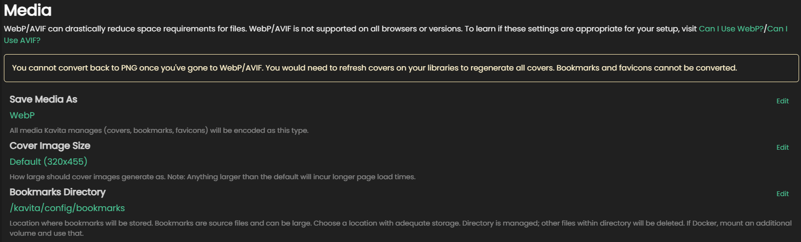

import { Callout } from 'nextra/components'

# Media Tab

### Save Media As

This setting tells Kavita what image format to use when creating thumbnails, covers and bookmarks. 
The 3 choices are:

* PNG (default)
* WebP
* AVIF

You should check the compatibility of the devices and browsers your users have before picking a format.

[Can I Use WebP](https://caniuse.com/webp)  
[Can I Use AVIF](https://caniuse.com/avif)

Both Webp and AVIF are widely accepted at the time of writing. Using a more efficient image standard will mean quicker transfer times over the network.

<Callout type="info">
  Once this setting is changed, you need to run the [convert media to target encoding task](tasks#convert-media-to-target-encoding) for your preferred setting to take place. 
</Callout>

### Cover Image Size
<Callout type="warning" emoji="⚠️">
  Changing the Cover Image Size to something larger than the default will impact the loading time of images, especially over remote connections.
</Callout>

This setting allows you to pick a larger resolution than the default.

Options are:

* Default - 320x455
* Medium - 640x909
* Large - 900x1277
* Extra Large - 1265x1795

<Callout type="info" emoji="ℹ️">
  Changing the above settings will NOT retroactively change covers. Once a new setting is picked, use the [convert media to target encoding task](tasks#convert-media-to-target-encoding) for all existing Bookmarks and covers.
</Callout>

### Bookmarks Directory

This setting lets you change where Kavita stores bookmarks the users create. Since making bookmarks saves a copy of the page outside of the initial library, this will take up additional space.

Changing this lets you store the bookmarks in a spot that has access to a larger pool of storage.