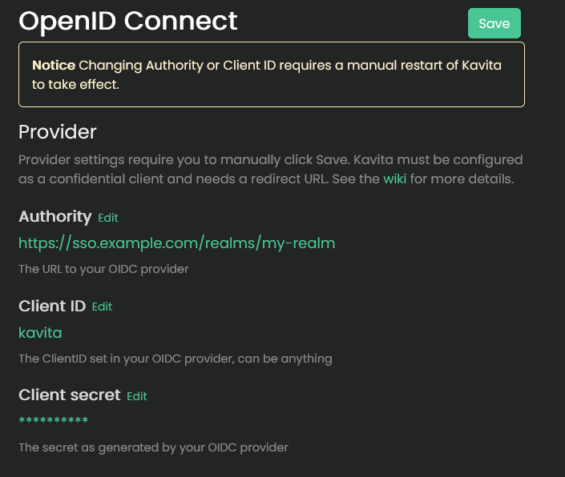

import { Callout } from 'nextra/components'

<Callout type="info">
    OpenID Connect support is part of the v0.8.8 release.
</Callout>

# OpenID Connect

OpenID Connect (OIDC) is a widely adopted authentication protocol built on top of OAuth 2.0, allowing users to sign in using a trusted identity provider. Kavita supports integration with any OIDC-compliant service, such as Authentik, Keycloak, and many others.

Kavita's implementation lets you use OIDC for authentication only or delegate full user and role management to your identity provider. It supports features like account linking, auto-provisioning, role syncing, and login customization.

## Setup

You can configure OpenID Connect directly from Kavita's Web UI. Some changes—Authority, Client ID, and Secret—require saving and restarting the application manually.

<Callout type="info">
  Kavita uses the discovery endpoint to load configuration dynamically. Ensure <code>&lt;your-url&gt;/.well-known/openid-configuration</code> is publicly accessible.
</Callout>

### Required Redirect URLs

You may need to configure the following URLs in your OIDC provider, not all providers require you to configure the logout URL, if you're using a custom base url adjust them accordingly:

| Purpose      | Path                     |
|--------------|--------------------------|
| Redirect URI | `/signin-oidc`           |
| Post-logout  | `/signout-callback-oidc` |

---

### Audience Claim

The audience (`aud`) claim **must match** the Client ID you have configured in Kavita.

<Callout type="warning">
  If the audience claim is incorrect, authentication will fail. Double-check the Client ID and ensure it's set as the audience in your OIDC provider.
</Callout>

---

## Features & Settings

Kavita allows a flexible integration: you can use your OIDC provider purely for login or let it fully manage user roles and access.

### Account Linking

When a user logs in via OIDC, Kavita will attempt to link the account by matching the email address.

---

### Provision Accounts

When enabled, Kavita will automatically create a new user if no matching email exists. See [Syncing](#syncing) for how permissions are handled for new accounts.

### Require Verified Emails

Ensures only verified email addresses are matched or used for account creation. It's strongly recommended to keep this enabled.

---

### Auto Login

When enabled, users are automatically redirected to the OIDC login page. You can bypass auto-login by adding `skipAutoLogin=true` to the login URL query string.

### Disable Password Authentication

Removes the local password login for non-admin users. Admins can still log in with a password.

To temporarily show the password field, add `forceShowPassword=true` to the login URL query string.

> Auth key authentication always remains available.

---

## Syncing

By default, users created via OIDC have no roles or library access. Kavita provides two options to assign and manage permissions:

### Native Permissions

If *Sync user settings with OIDC roles* is disabled, Kavita will use the default roles and library settings configured in the OpenID Connect admin UI. You can later adjust these manually in the Users panel.

---

### OIDC-Managed

If *Sync user settings with OIDC roles* is enabled, Kavita will derive user roles, library access, and age restrictions directly from your OIDC provider.

- Permissions are synchronized on each login.
- You cannot edit these roles within Kavita while syncing is enabled.
- You can switch the ownership between Kavita and OIDC at any time.

<Callout type="warning">
  Roles must be provided under the `roles` claim unless otherwise configured. Enable debug logging for troubleshooting.
</Callout>

#### Role Mapping

Kavita recognizes the following roles directly:

- All standard [roles](./users.mdx#roles), such as `Login`, `Download`, etc.
- Library access: `library-<LibraryName>` (e.g., `library-Manga`)
- Age restriction: `age-restriction-<Rating>` (e.g., `age-restriction-KidsToAdults`)
- To allow unknown ratings: `age-restriction-include-unknowns`

Roles are case-insensitive starting with v0.8.9

<Callout type="warning">
    Users will not be able to login without the `Login` role. You can use this role to restrict access to your Kavita instance while still allowing user creation.
</Callout>

#### Others

As Kavita grows other features will be added to also sync via OIDC.

- Kavita will sync your profile picture with the `picture` claim if you don't have a profile picture assigned at the time of syncing.

---

## Advanced settings

Kavita offers a few settings in case the default configuration is insufficient

### Roles prefix

Kavita will filter out all roles not starting with your configured prefix before trying to use them during sync. The prefix will be removed when using it.
e.g. If you have the prefix `kavita-` configured, your age restricting role could be `kavita-age-restriction-KidsToAdults`

### Roles claim

Under which claim should Kavita look for your configured roles. Must be in the root of the token.

<Callout type="warning">
    The default is `http://schemas.microsoft.com/ws/2008/06/identity/claims/role` and should be used when the roles are under `roles`.
    Using `roles`will **not** work as the library we use automatically maps some claims; you may find the full list [here](https://github.com/AzureAD/azure-activedirectory-identitymodel-extensions-for-dotnet/blob/dev/src/Microsoft.IdentityModel.JsonWebTokens/ClaimTypeMapping.cs).
</Callout>

### Custom scopes

You may configure extra scopes to be requested by Kavita on login. Login may fail if these are not configured correctly.

---

## Developer Notes

Some OIDC providers may require additional configuration to expose roles or correctly set the audience claim.

> Kavita does **not officially support or provide configuration help** for specific OIDC providers. However, everyone is welcome to ask questions in **non-support channels** on [Discord](https://discord.gg/b52wT37kt7) where the community might be able to help.

We encourage users to **contribute guides or notes for any OIDC providers** to help expand this section for the benefit of others.

### Authentik

When using Authentik you'll need to change some extra settings to get everything working correctly

- **Advanced Protocol Settings**: Ensure the `offline_access` scope is selected in the provider for Kavita in your Authentik settings.
- **Roles claim**: Ensure the roles claim is set to `groups` when using the `Sync user settings` feature.

### Authelia

When using Authelia, you'll need to configure some extra settings to ensure proper integration with Kavita when using the Sync User feature:

- **Roles claim**: Set the roles claim to `groups`.
- **Custom scopes**: Ensure the `groups` scope is included.

### Keycloak

When using Keycloak, you must manually configure dedicated client mappers:

- **Audience Mapper**: Ensure the correct `aud` claim is added to the token, matching Kavita's Client ID.
- **User Client Role Mapper**: Ensure user roles are exposed at the root of your token.

### PocketID

When using Pocket ID the `Sync user settings` will only sync after a full logout and login.

## Common issues

- **Non admin accounts can't see any series in their libraries**: If your series don't have age ratings applied you need to assign the `age-restriction-include-unknowns` role.

- **You do not have the required roles assigned to access this application**: If this error keeps popping up, your idp is not sending the roles where Kavita is looking for them. Check your configuration with the notes above

---
