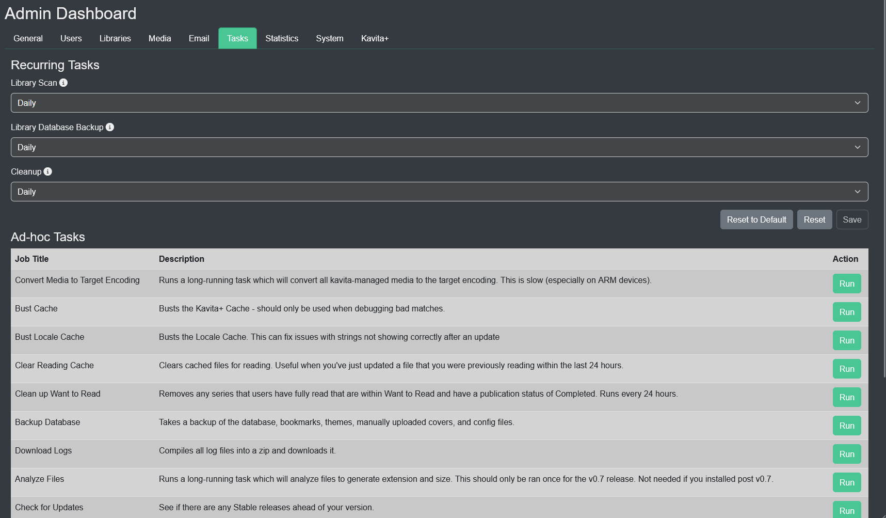

import { Callout } from 'nextra/components'

# Tasks Tab

## Recurring Tasks

Recurring tasks can customize their run time with cron jobs. [Check your cron](https://www.crontab.guru) syntax first before saving. 

* Disable = Never  
* Daily = Midnight in your local TZ  
* Weekly = Midnight on Monday in your local TZ  
* Custom =  Uses cron syntax to determine runtime

#### Library Scan
You can set the frequency that you want Kavita to scan for changes to your libraries. 

#### Kavita Backup
You can set the frequency that you want Kavita to backup its database and files. 

#### Cleanup 
<Callout type="error" emoji="️🚫">
  Do NOT disable this task. It will cause problems.
</Callout>

Kavita has a handful of processes that it needs to clean up eventually. This does tasks like reclaiming disk space and clearing out temp files.

## Ad-hoc Tasks

These are one-off tasks that you are able to run at any time. They do not have a schedule. 

#### Convert Media to Target Encoding

If you have changed the [Save Media As](media#save-media-as) to a different format you'll need to run this task to do a 1 time convert to use your target format.

#### Bust Cache

For Kavita+ users to clear out the K+ cache. This might be needed if a series matches the wrong series and keeps showing back up.

#### Bust Locale Cache

This can fix issues with localization strings not showing correctly after an update.

#### Clear Reading Cache

Clears files that Kavita has extracted that are sitting on disk. Can be useful if you've fixed an archive that you were already reading so that you don't get the old cached image.

#### Clean up Want to Read

Removes any series that users have fully read that are within their 'Want to Read' list. This is part of the [Cleanup](#cleanup) tasks that run and does not need to be manually triggered. 

#### Backup Database

Same as the [Kavita Backup](#kavita-backup) scheduled task, but lets you run it on demand.

#### Download Logs

Compiles all log files into a zip and downloads it. Useful if you're remote to your instance and need logs.

#### Analyze Files

Legacy scan option that starts a long-running task that will analyze files to generate extension and size. For users that had Kavita before 0.7.0 installed. 

####  Check for Updates 

See if there are any Stable releases ahead of your version. 

