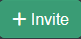

import { Callout } from 'nextra-theme-docs'

# Users Tab

From the Users Tab, admins can see the pending invites to their server and their active users. 

## Managing Users

### User Properties

Last Active will show the last timestamp that user was seen online. If they are online right now there will be a green dot at the end of the timestamp. 

If the user hasn't gone through the setup screen they will show as 'Pending'. Either they haven't opened the email sent (or didn't get it) or the admin hasn't setup the account manually.

Sharing: Will show all the libraries you have shared with that user. 

Roles will list out all the different permissions the user has. If the user is an admin it will just list "Admin", as admin users have all permissions possible and can't have roles restricted. 

### Editing Users 

Clicking on the edit users button will bring up the same dialog used to create the user. See the [Roles](#roles) reference for what options are available to you.

### Delete User

<Callout type="error" emoji="️⚠️">
  This action is irreversible and permanently deletes the users data.  
</Callout>

This removes the user from the server. All the users saved preferences and bookmarks will also be deleted. 

If you just want to prevent the user from logging in but still keep their account in the database, you can remove the [Login](#login) permission.

### Resend Invite

<Callout type="info">
  This action requires that you setup an email server in the [email](/guides/admin-settings/email) settings before using it.
</Callout>

If the user hasn't setup their account yet and has used an email address is on file, this will resend the new user setup email to them.

### Setup User

This will allow the admin to force setup the account and trigger the setup wizard manually. If you use this option you will have to give the person you setup the account for their username and password since they won't be able to choose for themselves. 

This option only shows up while the user is not setup. Once a user creates their account, this option is no longer available. 

## Inviting Users

To invite a user to your server click on: 

Once the new user screen comes up you can fill out all the required information.

Right now the wording may seem confusing, but you are able to create a username only account if you want. Just enter a username (without a @domain.com) and you can use that. As the screen notes however, username accounts can't use the email password reset option. They will have to ask the admin to reset their password for them. 

## Roles

### Admin

<Callout type="error" emoji="️⚠️">
  ! Admins have full access to the server !  
  
  They are able to make changes that could negitively impact other users or Kavita itself. 
</Callout>

They bypass all age restrictions, can change any and all server related settings and can see all libraries. Admins are also able to see full file paths on disk, where normal users only see the library path. 

It's not reccomended to use an admin account as your daily driver. Especially if you want to filter potentially NSFW material from view, as admins bypass all filtering restrictions.

Note: 

### Download

If checked, allows the user to download files. Controls downloads through both the webUI and and 3rd party applications that also allow downloads.

### Change Password

Lets the user change their own password through the user control panel.

If unchecked only admins will be able to reset the password for the user.

### Bookmark

Controls if the user is allowed to create bookmarks in their own profile. Reason this is a setting is because bookmarks are stored independently and thus take up some storage space on disk. 

### Change Restriction

Controls if the user is allowed to change their content restrictions. 

### Login

Controls if a user is allowed to login or not. This allows an admin to disable the account, but not delete the users stored settings and progress. 

### Age Rating Restriction

When selected, all series and reading lists that have at least one item that is greater than the selected restriction will be pruned from results. This is not applicable for admins.

### Include Unknowns

If this is checked any series that does not have the age rating defined will be treated as an unknown rating, thus blocking it from showing up for the user. 