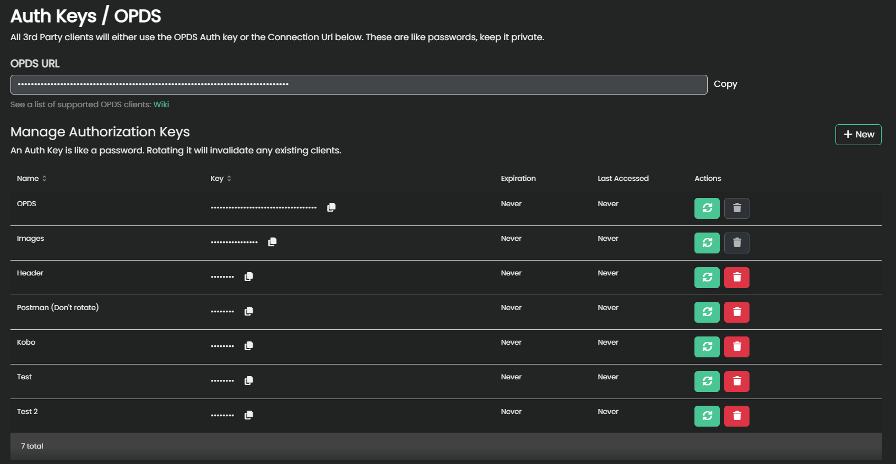

# API

## Authentication

Kavita has multiple methods of authentication, but the best approach would be to use Auth Keys. An Auth key is a user-created key with a custom expiration date (or none) and attach to the `x-api-key` header.

To check if there is an expiration limit, `GET /api/plugin/authkey-expires`. Null implies no expiration. Kavita will email users when an Auth Key is about to expire (if email is setup).



## Swagger UI

Kavita's REST API is documented using Swagger, however, the UI is disabled for non-dev instances. You can see [Kavita's API Docs](https://www.kavitareader.com/docs/api/#/) on the main Kavita website.

## OpenAPI

The link to the OpenAPI file is located here: https://raw.githubusercontent.com/Kareadita/Kavita/develop/openapi.json

## Python Example

Here's a small example written in Python for connecting to the `/api/Plugin/authenticate` endpoint, sending the API key, taking the 'token' response to add to the headers, then hitting the scan_endpoint with the JWT_Token attached in the headers.

```python copy
import requests
from urllib.parse import urlparse
from datetime import datetime, timezone

url = input("Paste in your full ODPS URL from your Kavita user dashboard (or url with auth key) (/preferences#clients): ")
parsed_url = urlparse(url)
host_address = parsed_url.scheme + "://" + parsed_url.netloc
api_key = parsed_url.path.split('/')[-1]

headers = {
    "x-api-key": api_key,
    "Content-Type": "application/json"
}

# Check if the API key is expired
try:
    expiry_response = requests.get(host_address + "/api/plugin/authkey-expires", headers=headers)
    expiry_response.raise_for_status()

    expiry_time = expiry_response.json().get("expiresAt")
    if expiry_time is not None:
        expiry_dt = datetime.fromisoformat(expiry_time.replace('Z', '+00:00'))
        if expiry_dt <= datetime.now(timezone.utc):
            print("Error: API key has expired")
            exit()
except requests.exceptions.RequestException as e:
    print("Error checking API key expiration:", e)
    exit()

# Perform the scan
scan_endpoint = "/api/Library/scan-all"
response = requests.post(host_address + scan_endpoint, headers=headers)
```
