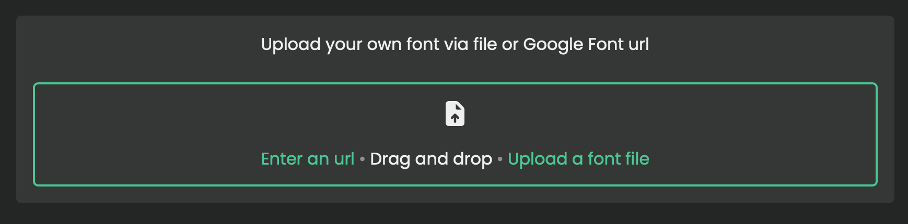
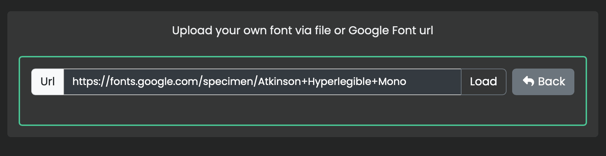
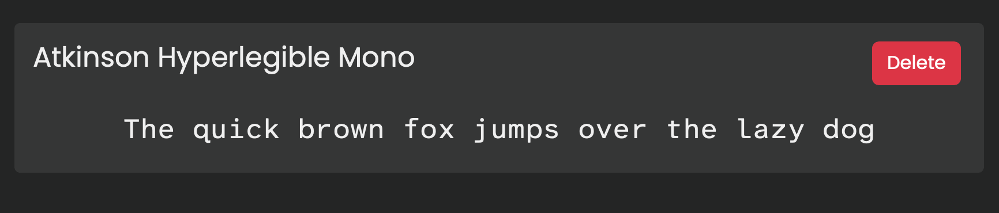

import { Callout } from 'nextra/components'

# Custom Fonts

The Epub reader comes with a few fonts included, you are able to bring your own as well. Either by uploading, or download from Google Fonts.

<Callout type="warning">
    Fonts only work if the epub does not forcefully set fonts on individual elements. You can clean this with calibre.
</Callout>

### Upload

When uploading a font, the font name is automatically created from its filename.

### Download

For convince, you can also directly download from [Google Fonts](https://fonts.google.com/).

Copy and paste a url (E.g. https://fonts.google.com/specimen/Atkinson+Hyperlegible+Mono) from your browser and press load to download.

### Preview

You can then preview your font by selecting it in the menu

