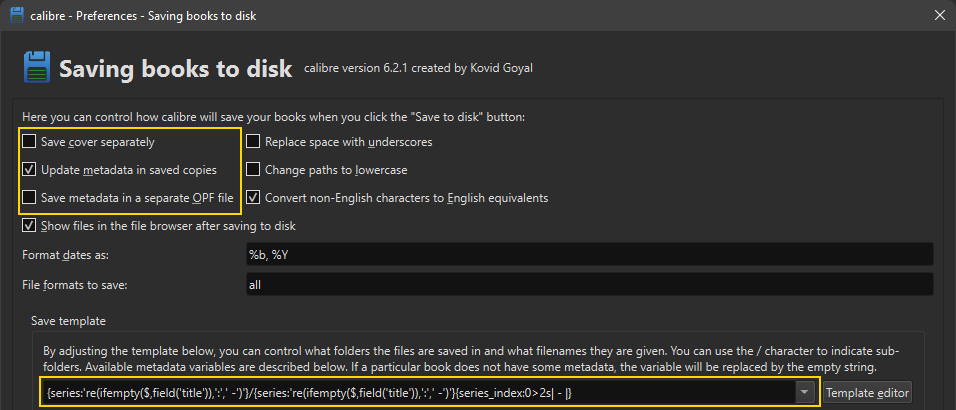

import { Callout } from 'nextra/components'

## Calibre E-book Management

With [Calibre ebook management](https://calibre-ebook.com/) you can set the metadata correctly in your epubs to be used in Kavita. 

Once you loaded the books you want to correct for the use in Kavita into Calibre you can edit the metadata by right-clicking the book and selecting Edit Metadata, or using the hotkey E on your keyboard. In this window make sure the Series and Number (book order in the series) is set correctly if you have multiple books that belong to a single series. Futhermore, also correct the Title and Authors field if nessesary.

Once you are done with the metadata adjustments you can select the books and use Save to Disk > Save only EPUB format to disk in a single folder to export the books with updated metadata. However, to make it easier for you, you can keep on reading to adjust the Save to Disk settings to have automatically the correct directory created for your books that you can directly use in your Kavita library!

## Calibre Save to Disk template for Kavita

<Callout type="warning" emoji="⚠️">
    Calibre does not have sane defaults out of the box. You need to change the default settings to use your epubs in Kavita. 
</Callout>

 With the following save template you can have Calibre automatically create these for you, either by the set series name or the book title if no series is set. The filename will be the same, except with the series number added if the book is part of a series. In addition, it will convert any colons, used as sub-title, to a hyphen (assuming you leave a space after the colon).

1. Open the Preferences in Calibre
2. Click on 'Saving books to Disk' (found under Import/Export)
3. Make sure 'Save cover separately' is **unchecked**.
4. Make sure 'Update metadata in saved copies' is **checked**.
5. Make sure 'Save metadata in separate OPF file' is **unchecked**.
6. Adjust the 'Save template' to the following value;

`{series:'re(ifempty($,field('title')),':',' -')'}/{series:'re(ifempty($,field('title')),':',' -')'}{series_index:0>2s| - |}`



After having set these settings, Save to Disk will write the selected books to disk as;
```
Save to Disk target
└── Series Name A
    └── Series Name A - 01.epub
    └── Series Name A - 02.epub
└── Series Name B
    └── Series Name B - 01.epub
└── Title of a Book
    └── Title of a Book.epub
└── Some other Book
    └── Some other Book.epub
```
_Depending if the book has a series or not, if no series then it will use the title of the book._

## Using the Save to Disk template

1. Select the book(s) you want to export that are ready for Kavita (having set the metadata).
2. Click 'Save to Disk' (the big blue floppy disk).
3. Now select a directory to save to, this can already be the root directory of your Kavita Library!
4. Move the created directories (with books) to your Kavita library root directory, if needed.

Note; Using 'Save only EPUB format to disk in a single folder' will not create a directory for the saved books, which is required by Kavita.

## Adjusting Title Sort in saved directory and filename

By default Calibre will use title_sort when using Save to Disk, this means that, for example in the English language: The, A, An are placed at the end of the title/series, instead of at the beginning. If you do not want this for your directory/filename then you can adjust this by doing the following.

1. Open the Preferences in Calibre
2. Click on 'Tweaks' (found under Advanced)
2. Search for the tweak: `save_template_title_series_sorting`
3. Edit the tweak to: `save_template_title_series_sorting = 'strictly_alphabetic'`


## Adjusting the prefix of the series index

You can modify the part between the series name and the index if you do wish to have this different. Take note that this does not affect the metadata shown in Kavita and is purely (aesthetic) for the filename. For example, if you want to have `, Vol. ` instead of a hyphen you can change the template to the following.

`{series:'re(ifempty($,field('title')),':',' -')'}/{series:'re(ifempty($,field('title')),':',' -')'}{series_index:0>2s|, Vol. |}`

> The Series Name/The Series Name, Vol. 01.epub

Or perhaps more like manga.

`{series:'re(ifempty($,field('title')),':',' -')'}/{series:'re(ifempty($,field('title')),':',' -')'}{series_index:0>2s| v|}`

> The Series Name/The Series Name v01.epub

Or nothing.

`{series:'re(ifempty($,field('title')),':',' -')'}/{series:'re(ifempty($,field('title')),':',' -')'}{series_index:0>2s| |}`

> The Series Name/The Series Name 01.epub

## Adding authors to the filename and directory

If you would like to have the authors added to the directory and filename of the book that is **not** part of a series, or in case you have books that have the same title, you can use the following template instead.

`{series:'re(ifempty($,field('title') & ' - ' & field('authors')),':',' -')'}/{series:'re(ifempty($,field('title') & ' - ' & field('authors')),':',' -')'}{series_index:0>2s| - |}`

> Title of the Book - Author Name/Title of the Book - Author Name.epub

## Using polish to clean up your epubs

Polish is a very useful tool that is included by default within calibre but is hidden. It has a handful of very useful functions that will clean up the epub typically resulting in a smaller epub with embedded metadata and can even upgrade the internals of a EPUB2 to an EPUB3. It's highly recommended as a last step before bringing the files to kavita because you can guarantee your metadata will be included and a smaller filesize can make a massive difference when it comes to serving that file.

To access polish:
 1. Go to preferences > Toolbars & menus. 
 2. Choose the toolbar that fits best but the main toolbar is the one you'll likely be adding it to. 
 3. On the left you'll see Available actions and on the right you'll see Current actions. Available actions are the plugins and options that are currently "hidden". 
 4. Scroll through Available actions and select Polish books. It'll have a little featherduster next to it.
 5. Click the green arrow pointing to the right to add it to Current actions. 
 6. Now it should be at the bottom of Current Actions. You can select it and click the up and down arrows to the right to move it to the location you want it.
 7. Exit back to the main calibre window you should have a Polish books button. Select a book or multiple then click on the button to pull up this screen.
 


The important settings on this screen are `Update metadata in the book files` and `Upgrade book internals`. Everything else is your preference and has an about next to it explaining what exactly each option does.
The options that can rather dramatically cut down on filesize are `Embed all refrenced fonts`, `Subset all embedded fonts`, `Remove unused CSS rules from the book`, and `Losslessly compress images`. When you're happy with the selections click on OK and it will start polishing. 

It can take some time to process all of them. If you have `Show report` turned on when it finishes it will give you a popup breaking down exactly what was done. Now your books are ready for kavita.
