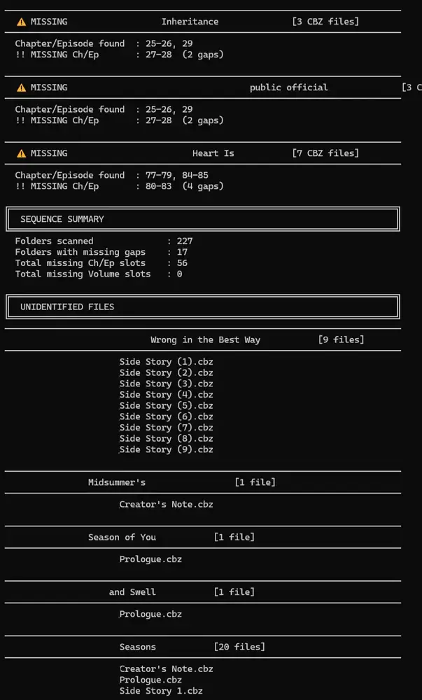

## [CBZ-Missing-Sequence-Checker](https://github.com/Ark1369/CBZ-Missing-Sequence-Checker)

A smart, lightweight Python command-line utility that recursively scans your manga, manhwa, or comic directories to detect .cbz files and reports any missing chapter or volume numbers. It is built to handle messy file names, omnibus ranges, decimal chapters, and release metadata.

### Features

- **Smart Identifier Recognition**: Automatically detects standard naming conventions like Chapter, Chap, Ch, C, Episode, Ep, Volume, Vol, and v.
- **Omnibus & Range Support**: Understands multi-chapter files. A file named Series Chapter 01-03.cbz is correctly parsed as containing chapters 1, 2, and 3.
- **Decimal Chapter Handling**: Seamlessly supports interstitial chapters (e.g., 112.1, 27.2) without falsely flagging gaps.
- **Intelligent Sequence Fallback**: If files lack clear identifiers (e.g., XYZ 017.cbz), the script analyzes the files in the folder, ignores static numbers, and tracks the changing sequential numbers to establish the chapter order.
- **Metadata Filtering**: Automatically strips out release years, ripper tags, and format info hidden inside parentheses () or brackets [] (e.g., (2025), (Digital)) to prevent false sequencing.
- **Clutter-Free Reporting**: By default, it only reports folders that have actual missing files. Complete folders are hidden to keep your reports clean.
- **Optional Unidentified Files Reporting**: Files that lack any sort of Chapter or Volume Schema in their names. (Will get False Positive for One Shots).
---



#### Available Commands

Command	Description
- python cbz_missing_checker.py [ROOT]	Simple report of missing files (default)
- python cbz_missing_checker.py [ROOT] -d	Detailed report of missing files, showing found ranges and gaps
- python cbz_missing_checker.py [ROOT] -u	Simple report + prints a list of unidentified files at the bottom
- python cbz_missing_checker.py [ROOT] -d -u	Detailed report + prints a list of unidentified files at the bottom
- python cbz_missing_checker.py [ROOT] -a	Shows ALL folders, including complete/gap-free sequences
- python cbz_missing_checker.py [ROOT] -o out.txt	Saves the generated report to a specific file (default is cbz_missing_report.txt)
- python cbz_missing_checker.py [ROOT] --no-file	Prints the results to the console only without saving a text file

#### Examples
Detailed Mode (-d)
Provides a visual breakdown of exactly what ranges were found and what specific gaps exist.

bash
python cbz_missing_checker.py "D:\Manga Library" -d

Output snippet:

```────────────────────────────────────────────────────────────────────────────
  ⚠  MISSING  XYZ Series  [49 CBZ files]
────────────────────────────────────────────────────────────────────────────
  Chapter/Episode found  : 48-80, 82-92
  !! MISSING Ch/Ep       : 81  (1 gap)
```

Tracking Unidentified Files (-u)
Useful for hunting down files with completely garbled names that the smart-fallback couldn't resolve.

bash
python cbz_missing_checker.py "D:\Manga Library" -d -u

Output snippet:
```
────────────────────────────────────────────────────────────────────────────
  XYZ Series  [1 file]
────────────────────────────────────────────────────────────────────────────
    Prologue.cbz
```
