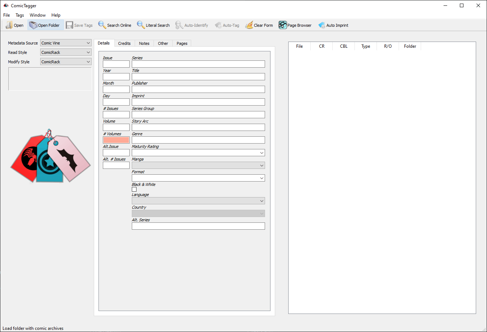

import { Callout } from 'nextra-theme-docs'

## ComicTagger
* Runs on macOS, Microsoft Windows, and Linux systems
* Get comic information from Comic Vine
* Automatic issue matching using advanced image processing techniques
* Batch processing in the GUI for tagging hundreds or more comics at a time
* Support for ComicRack and ComicBookLover tagging formats
* Native full support for CBZ digital comics
* Native read only support for CBR digital comics: full support enabled installing additional rar tools
* Command line interface (CLI) enabling custom scripting and batch operations on large collections

[Go to comic tagger repo](https://github.com/comictagger/comictagger)