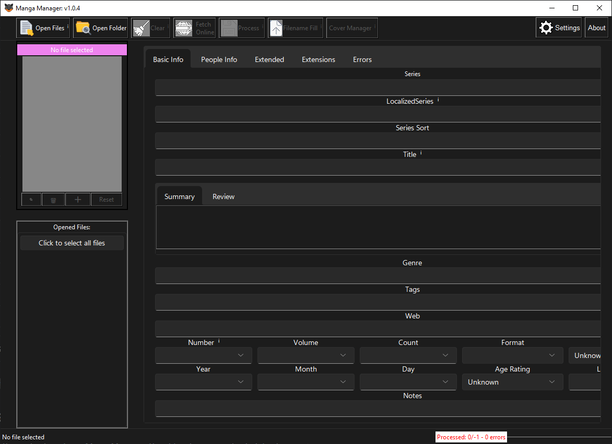

## Manga-Manager

* Actively developed.
* Extremely fast editings
* Bulk updates via GUI and CLI
* Allows for metadata scraping (currently limited to AniList and MangaUpdates, but more coming soon)
* Change covers and backcover (changes the first and last image of the file)
* Metadata editor with clear UI (allows bulk selection)
* Support for CLI usage
* Webp Converter
* Docker support for headless systems

[Go to MangaManager repo](https://github.com/ThePromidius/Manga-Manager)