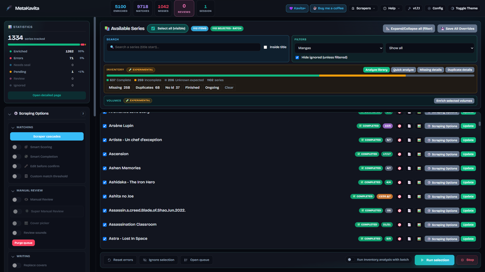

import { Callout } from 'nextra/components'

## [MetaKavita](https://github.com/raukorim-bot/MetaKavita)

**MetaKavita** is a self-hosted metadata enricher and manager for [Kavita](https://kavitareader.com/). It detects library types (Manga, Comic, Comic Flexible, Book), scrapes summaries, years, publication status, genres, tags, staff, publishers, age ratings and covers from public sources, optionally translates summaries, and writes the result into Kavita through the API.

It is a community project (v1.7), actively developed. Full documentation lives in the [GitHub README](https://github.com/raukorim-bot/MetaKavita).



<Callout type="info">
MetaKavita is designed as a LAN / VPN management tool. Read the [security notes](https://github.com/raukorim-bot/MetaKavita#-security-disclaimer--deployment-best-practices) before exposing it to the public internet.
</Callout>

## Features

### Providers and community scrapers

Built-in sources cover manga, comics/BD and books. A **Community Store** installs extra scrapers (and keeps core ones updated) without rebuilding the image.

* **Manga:** MangaDex, AniList, Kitsu, Shikimori, MangaBaka, MangaUpdates, Manga-News, MyAnimeList, Anime News Network
* **Comics / BD:** ComicVine, Bédéthèque, BDTheque, Planète BD, Metron, League of Comic Geeks
* **Books:** Google Books, Open Library, Hardcover, Babelio, Decitre, SensCritique
* **Community Store:** optional sources such as Wikidata, plus user-made scrapers from [community-scraper-metakavita](https://github.com/raukorim-bot/community-scraper-metakavita)

Some sources also serve a second library type (AniList, MAL, MangaBaka, Google Books, Open Library, Hardcover, SensCritique).

### Matching and writes

* **Smart Scoring:** configured providers compete; the best match wins. **Smart Completion** fills missing fields from the next-best sources.
* **Magic Input:** paste a provider URL or ID to scrape that exact page.
* **Targeted fields:** choose which metadata fields MetaKavita may write, per series or for the next batch (summary, cover, staff, genres, tags, year, publisher, age rating, web links, and more).
* **Manual covers:** a cover you pick by hand is marked and is not overwritten by later automatic scrapes.
* **Manual Review:** scrape without writing to Kavita; pick, merge and edit candidates before confirming.

### Library tools

* **Inventory** (on by default, read-only): see which series are missing volumes or chapters, find likely duplicates, export CSV/TXT. Duplicate groups show Kavita folder paths and can generate a bash `mv`/`rm` script — MetaKavita never deletes files or Kavita records itself.
* **Per-volume / album metadata** (off by default): preview then write album title, summary, release date, ISBN and cover into empty fields. Sources include ComicVine, Bédéthèque, Planète BD, Manga-News, MangaDex covers, and ISBN lookups (Google Books / Open Library / Hardcover).
* **Light mode:** hide Manual Review, Inventory and/or volume enrichment from the sidebar if you do not use them. Hiding a section also switches that feature off.

### Translation, automation, Companion

* Translate summaries with Google Translate (free), Azure Translator, or DeepL.
* Auto-sync polling and token-authenticated webhooks.
* Live dashboard: covers stream in as providers answer; batch progress and logs arrive over WebSockets.
* **MetaKavita Companion** (Chrome / Firefox, sideload beta): Super Review, Auto and Cover actions on Kavita series pages.

## Installation (Docker)

Create a `docker-compose.yml` anywhere on your server:

```yaml copy
services:
  metakavita:
    image: ghcr.io/raukorim-bot/metakavita:latest   # or pin :1.7.0
    container_name: metakavita
    restart: unless-stopped
    ports:
      - "5010:5010"
    extra_hosts:
      - "host.docker.internal:host-gateway"
    environment:
      - TRUSTED_PROXY_COUNT=0   # set to 1 if behind a reverse proxy
      # - KAVITA_URL=http://host.docker.internal:5000
      # - ROOT_PATH=/metakavita
    volumes:
      - ./data:/app/data
```

```bash copy
docker compose up -d
```

Open `http://localhost:5010`. The first run is a setup wizard (account, Kavita URL and API key, languages, options).

<Callout type="warning">
Do not set `KAVITA_URL` to `localhost` inside the container — that is MetaKavita itself. Use `host.docker.internal` when Kavita is published on the host, or the Docker service name when both containers share a network.

`ADMIN_PASSWORD` was removed. The wizard creates the account. To pre-provision, set `ADMIN_PASSWORD_HASH` (see the README).
</Callout>

## More

* [GitHub repository](https://github.com/raukorim-bot/MetaKavita)
* [Companion extension](https://github.com/raukorim-bot/MetaKavita/blob/main/companion/README.md)
* [Community scrapers](https://github.com/raukorim-bot/community-scraper-metakavita)
