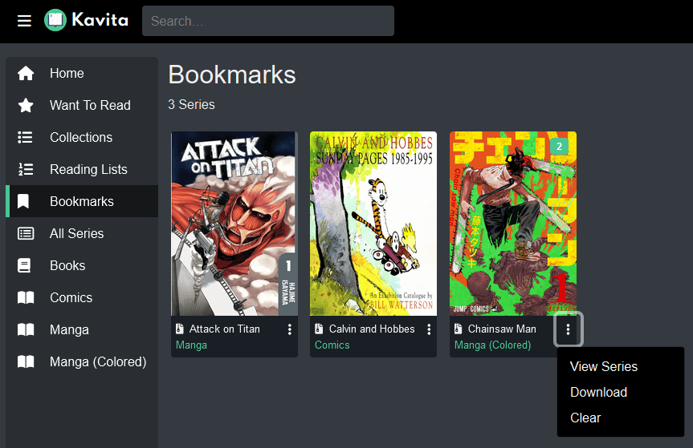

import { Callout } from 'nextra/components'

# Bookmarks

Bookmarks allow you to save individual images you want to revisit later. They can be accessed from the Bookmarks Library. Bookmarks can be created from the Image reader and the EPub Reader. 

#### Removing Bookmarks
- To remove an individual bookmark, navigate back to the original file (the "View Series" button is useful for this) and remove the bookmark from the page.
- To remove all bookmarks from a series, open the context menu and click "Clear".

#### Downloading Bookmarks
- Bookmarks can be downloaded from each series' context menu by clicking "Download".
- If you have access to the filesystem, bookmarks can be downloaded from `config/bookmarks/`. The admin can set the location they want to use in the [Media Settings](../admin-settings/media.mdx#bookmarks-directory) tab. 