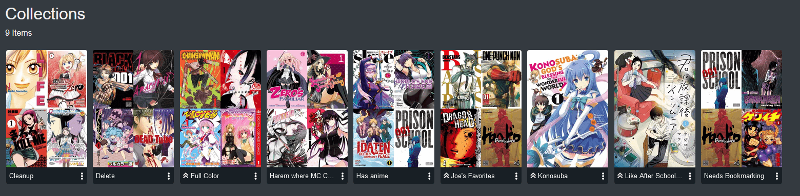

import { Callout } from 'nextra-theme-docs'

## Collections

A collection is a set of series grouped together manually. A collection can be promoted by the admin thus making the collection visible to all users. However, just because the collection is visible, does not mean the individual user can view series in it they are not privy to. If a user does not have access to a library or series outside of their age restriction, those series will not be visible to said user. A collection can contain any series from any library and thus can be formatted.

For example, a user may have a collection called "KonoSuba" and it may contain all Konosuba works including light novels, spin-offs, manga, TTRPGs, etc. 

To create a collection, select the Edit option in the Context Action Menu. A collections tag can be created and will be used to create a collection with that name. Other books, comics and manga can have this tag added to become part of the collection.

Collections can be accessed from the list of libraries, or from a series that is part of a collection.

When selected, all series in the collection will be available.

To edit a collection, click on the Context Action button and select Edit.

## User access

Although a promoted collection can be seen by others, they may not have access to the items due to user access restrictions on what Libraries they can see.

## Sharing Collections

To share a collection with other Kavita users you "promote" it. This lets other users on your instance see the collection. 

## Deleting Collections 

To Delete a Collection uncheck all Series in the Collection and hit Save. A popup will warn that you are about to delete the Collection.

You can also click on the 3 dot edit menu and select "Delete" from the collections screen.

## Custom Cover Images 

To edit the cover image for a collection, select the Cover Image tab and choose a method to select a new cover. The Cover can also be Reset to default on this Tab.
