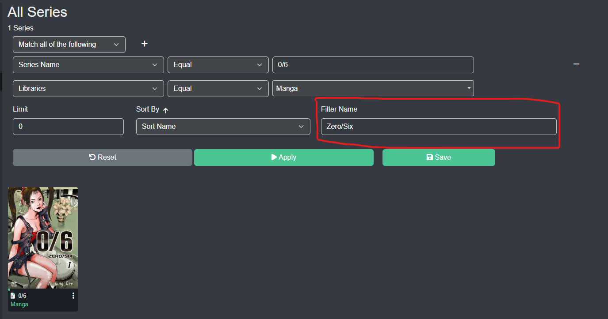

## Metadata Filtering
Kavita has a rich metadata interface that allows you to build complex filters to find exactly what you're looking for. The system allows you to build a series of statements that AND or OR together with custom sorting and a limit feature for those that have large libraries. 

These filters are dynamic and will update as you change the values. If you add new series with metadata that matches the filter, they will automatically be added to the results.

### Filter Fields
| Field           |       Field Type     |          Description            |
| ------ | ----------- |----------- |
| Age Rating               | Single/Multi Select | Age Rating of Series                                                      |
| Artist                   | Single/Multi Select | Artist of Series                                                          |
| Average Rating           | Number              | Kavita+ external rating, percent                                          |
| Characters               | Single/Multi Select | Character in Series                                                       |
| Collection Tag           | Single/Multi Select | Series that belongs in a Collection                                       |
| Colorist                 | Single/Multi Select | Colorist of Series                                                        |
| File Path                | String              | The full file path for any file within the Series (note: this is slower than other fields) |
| Format                   | Single/Multi Select | Series Format (epub, archive, etc)                                        |
| Genres                   | Single/Multi Select | Genre in Series                                                           |
| Imprint                  | Single/Multi Select | Publisher Imprint                                                         |
| Inker                    | Single/Multi Select | Inker of Series                                                           |
| Languages                | Single/Multi Select | Language of Series                                                        |
| Letterer                 | Single/Multi Select | Letterer of Series                                                        |
| Library                  | Single/Multi Select | Library within Kavita                                                     |
| Location                 | Single/Multi Select | Physical Location Series takes place in                                   |
| Path                     | String              | The file path to the highest level of the Series                          |
| Penciller                | Single/Multi Select | Penciller of Series                                                       |
| People*                  | Single/Multi Select | Person of some Role that is on the Series                                 |
| Publication Status       | Single/Multi Select | Publication Status of Series (ie Complete, Hiatus, etc)                   |
| Publisher                | Single/Multi Select | Publisher of Series                                                       |
| Read Progress            | Number              | Decimal percentage of Series that is read by user                         |
| Read Time                | Number              | Number of hours to read the Series                                        |
| Read Last                | Number              | Number of days from TODAY the Series was read                             |
| Reading Date             | Date                | Latest date the Series was read by the user                               |
| Release Year             | Number              | The Release year of the Series (minimum from all chapters)                |
| Series Name              | String              | The Name of the Series                                                    |
| Summary                  | String              | The Summary of the Series                                                 |
| Tags                     | Single/Multi Select | Tag in Series                                                             |
| Team                     | Single/Multi Select | Teams that appear in Series                                               |
| Translators              | Single/Multi Select | Translator of Series                                                      |
| User Rating              | Number              | User Rating percentage of Series by user                                  |
| Want To Read             | Boolean             | If Series is in the user's Want To Read list                              |
| Writers                  | Single/Multi Select | Writer of Series                                                          |

* People refers to fields such as Translator, Editor, Inker, etc

#### Filter Combination
| Filter Combination      | Applies on                  | Description                                                    |
|-------------------------|----------------------------|---------------------------------------------------------------|
| `Equal`                 | String/Number/Multi Select | Equals exactly                                                |
| `Not Equal`             | String/Number/Multi Select | Doesn't Equal                                                 |
| `Begins With`           | String                     | Starts with string                                            |
| `Ends With`             | String                     | Ends with string                                              |
| `Matches`               | String                     | Applies a search-like match on the field                      |
| `Is Before`             | Date                       | Date is before X                                              |
| `Is After`              | Date                       | Date is after X                                               |
| `Less Than`             | Number                     | Less than X                                                   |
| `Less Than Equal`       | Number                     | Less than or Equal to X                                       |
| `Greater Than`          | Number                     | Greater than X                                                |
| `Greater Than Equal`    | Number                     | Greater than or Equal to X                                    |
| `Contains`              | Multi Select               | The Filter Field contains at least one entry of what is passed |
| `Must Contains`         | Multi Select               | The Filter Field contains all of what is passed               |
| `Must Not Contains`     | Multi Select               | The Filter Field contains none of what is passed              |

### Sort Fields
| Field                |        Description                            |
| -------------------- | --------------------------------------------- |
| Sort Name            | Sort Name of Series                           |
| Average Rating       | Average Rating of Series (Kavita+)            |
| Created              | Creation Date                                 |
| Item Added           | Date of Series being updated with new files   |
| Item Modified        | Date of any modification to Series            |
| Last Read            | Date of Progress on Series by You             |
| My Rating            | My Rating against a Series                    |
| Random               | Randomize output                              |
| Release Year         | Release Year of Series                        |
| Time To Read         | Average time to Read whole Series             |

### Smart Filters
A Smart Filter is essentially a saved filter. The underlying filter can be loaded and changed and anything that is bound with the Smart Filter will automatically be reflected in the new filters. Once you have a Smart Filter created, check out [Customization](https://wiki.kavitareader.com/en/guides/customization) to learn about how you can utilize the filters.

To create a Smart Filter, just add a name in the Name field and hit Save. Smart Filter names must be unique per user. Smart Filters are user-bound. 

