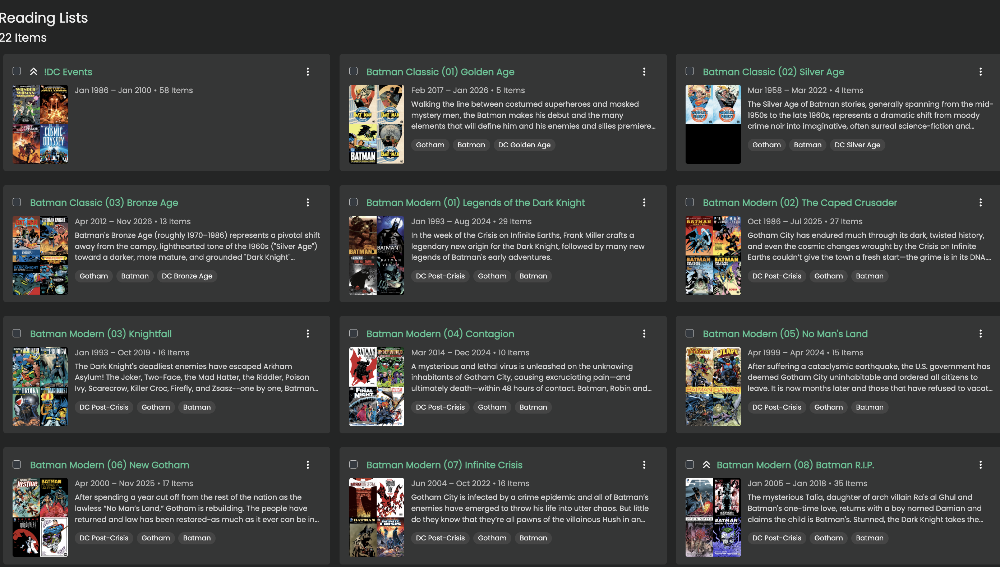
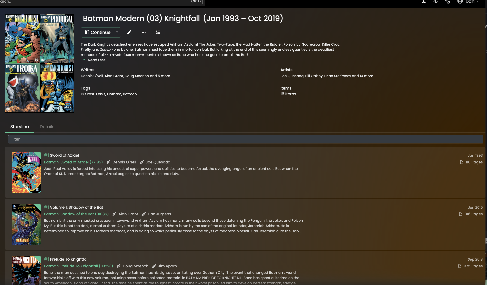
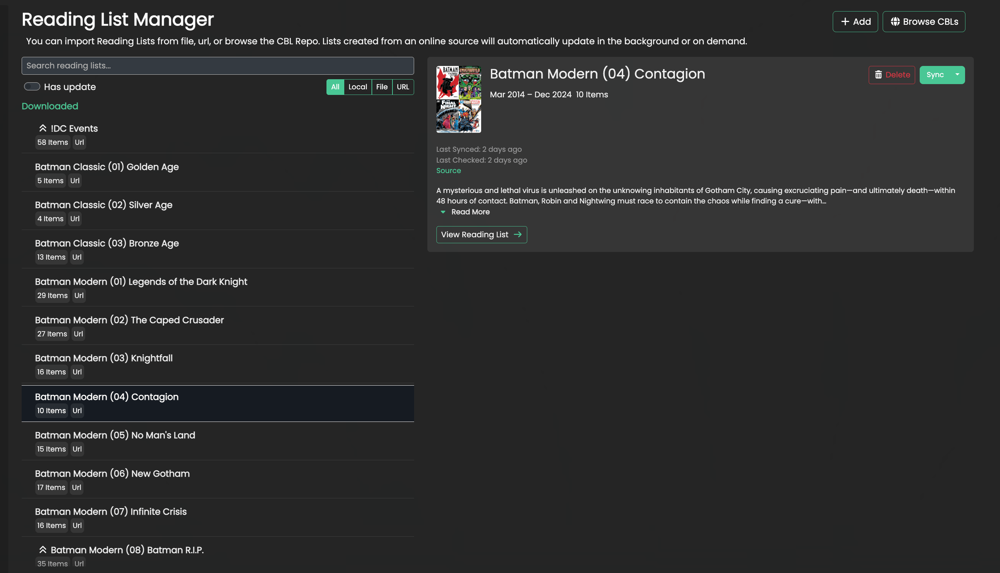
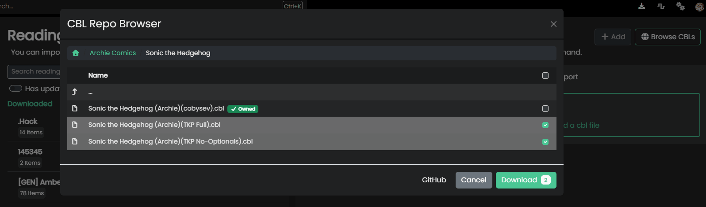
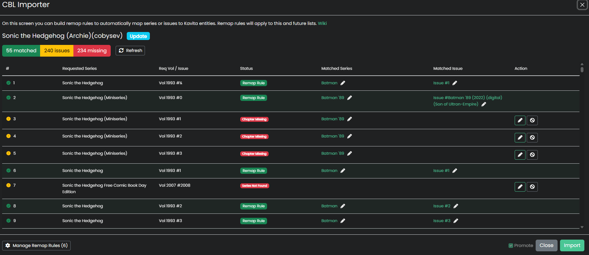
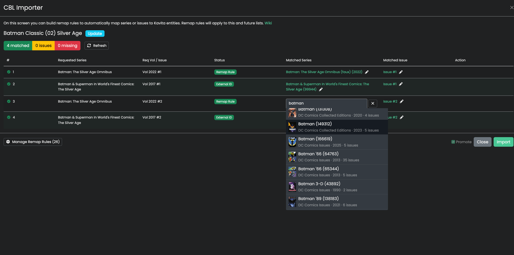
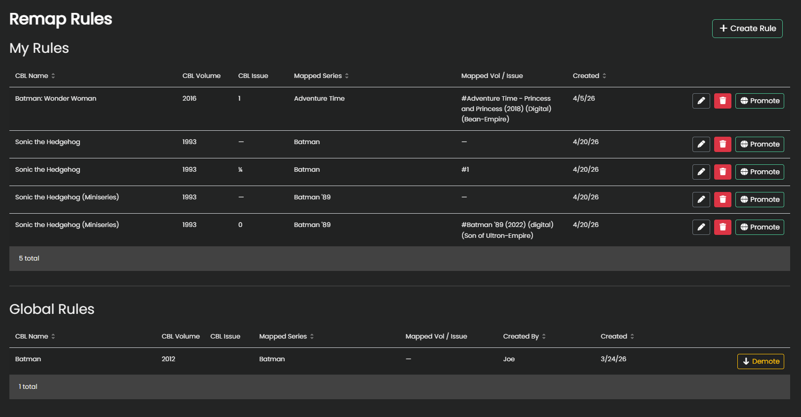

import { Steps } from 'nextra/components'

# Reading Lists

Reading Lists are an ordered set of chapters that can be created by any user and promoted (made visible to all users on the server) by admins. Like Collections, they can have a cover image and summary. 

The main feature of a reading list is the order. Reading order is enforced at the chapter/issue level. When reading said list, the readers are capable of moving between different types of readers. So the list could start with Manga then move into epub reader then to pdf and back to Manga without ever leaving the reader. 

The list order can be changed by clicking Order Numbers button or exporting as CBL, reordering exeternally then importing again. 

## Creating a Reading List via CBL 
Kavita supports the creation of Reading Lists via CBL files. From the side menu, click the actions menu (...) next to `Reading List` and select `CBL Manager`.

<Steps>

## The Manager Screen

This is the Manager for CBLs. Kavita supports both the CBL v1 (.cbl) and v2 (.json) formats. From this screen, you can manage your existing imported lists or import new ones. 

To Import, you can either use the Browse to browse the CBL Reading List repo or upload by Url/file. Any url-based list will run a sync (import) every 3 days if there are changes in the list. 

## Browse for a List/Upload from file/url

Here you see that I have uploaded multiple files. I can remove which ones I might not want to move to the next step.

Upon hitting next, you can see that some of these failed the validation step. Validation is a lightweight step meant to quickly cull errors, like invalid CBL formats, missing access to series/libraries (via rating or library restrictions), etc. Those that have failed will not be moved to the next step. You do not need to manually remove them. 

## Make decisions and save them for next time (Remap Rules)

This is the basis of the remap rules functionality. In the first image, there are a multitude of missing series and chapters. I use the edit button to teach Kavita about what I want. These decisions will create remap rules, so the next import I'm not repeating myself.

## Import

Hit Import for the list, Kavita will create the final entry (or update the existing). Any items skipped or not matched will be skipped but counted. You wlil see missing items on that list (and can filter for it).

From the manager screen, you can see when the list was last updated and trigger an automatic sync or manual. 

</Steps>

## Remap Rules

These are rules for the CBL Import screen that teach Kavita how to map some data from a CBL to an internal Kavita entity. 

Kavita supports promotion (making applicable to all users) as well as user-defined remap rules. 

The easiest way to manage is via the `settings#remap-rules` page. 