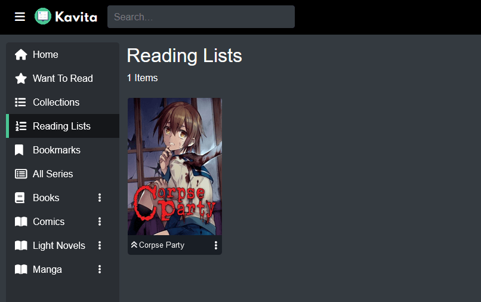

import { Steps } from 'nextra/components'

# Reading Lists

Reading Lists are an ordered set of chapters that can be created by any user and promoted (made visible to all users on the server) by admins. Like Collections, they can have a a cover image and summary. 

The main features of a reading list are the order. Reading order is enforced at the chapter level. When reading said list, the readers are capable of moving between different types of readers. So the list could start with Manga then move into epub reader then to pdf and back to Manga without ever leaving the reader. 

The list order can be changed by using drag and drop or clicking Order Numbers and shifting order number directly. 

## Creating a Reading List via CBL
Kavita supports creation of Reading Lists via CBL files. From the side menu, click the ... menu next to `Home` and select `Import CBL`.

<Steps>

## Step 1 

This will bring up the initial screen showing the wizard like import. From here, the user can select multiple cbl files. 
 

## Step 2

Here you see that I have uploaded multiple files. I can remove which ones I might not want to move to the next step.

Upon hitting next, you can see that some of these failed the validation step. Validation is a light-weight step meant to quickly cull errors, like invalid CBL formats, missing access to series/libraries (via rating or library restrictions), etc. Those that have failed will not be moved to the next step. You do not need to manually remove them. 

## Step 3

The next step is a dry run. Validation step can't catch everything that might happen during reading list creation, so the dry run pretends to create the Reading List without saving to the DB. Here you will see more errors around missing issues/volumes, etc. You will not be able to move forward unless there are at least partial or full success. Failures will prevent import as that implies everything in the list failed.

## Step 4

Once you're done, your reading list should appear in your library and you can restart the flow from the UI or close it and view your reading list. 

## Step 5

</Steps>