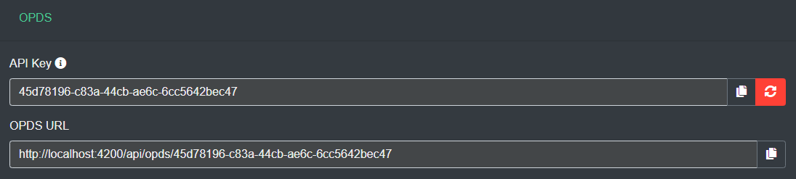

OPDS is an open standard for browsing and consuming content on your server from external readers. OPDS support is enabled by default on all Kavita installs. 

This will grant all your users a unique URL and API key to access your server from external readers.

From this UI, a user can use the copy button to quickly copy it into their clipboard. If the admin has set the [hostname](../guides/admin-settings/general.mdx#host-name) of the server, then the OPDS URL will be the full domain name. 

Kavita supports OPDS and the expanded page streaming specification called OPDS-PS. It's important to note that OPDS only supports .epub files. The expanded OPDS-PS can support images, but not as many clients have support for it.

While OPDS and OPDS-PS cover a lot of use cases, the absolute best way to interact with the content on your server is through Kavita's API. Clients that use the API have a richer experience and can support new advanced features as they are added to Kavita.

## OPDS capable clients

### Android

| Name        | Opds | Opds-PS | Epub | Progress Sync | API |
|-------------|:----:|:---------:|:----:|:-------------:| :-----------:| 
| Librera     |  ✓   | ✗       |  ✓   |       ✗       |      ✗       |
| Moon Reader |  ✓   | ✗       |  ✓   |       ✗       |      ✗       |
| Kubo Reader |      | ✗       |  ✗   |       ✗       |      ✗       |
| [Mihon](../guides/3rdparty/tachi-like.mdx)   |  ✗*  | ✗       |  ✗   |      ✓**      |      ✓       |
| [CDisplayEx](../guides/3rdparty/cdisplayex.mdx)   |  ✗*  | ✗       |  ✗   |      ✓      |      ✓       |

`*` Does not use opds. However, for ease of setup, the same link retrieved from this setting is used  
`**` Progress syncing is done per chapter, not per page

### iOS

| Name      | Opds | Opds-PS | Epub | Progress Sync | API |
|-----------|:----:|:-------:|:----:|:-------------:| :-------------: |
| Chunky    |  ✓   |    ✓    |  ✗   |       ✓       |      ✗       |
| Panels    |  ✓   |    ✓    |  ✗   |       ✓       |      ✗       |
| Yomu      |  ✓   |    ✗    |  ✓   |       ✗       |      ✗       |
| [Paperback](../guides/3rdparty/paperback.mdx) | ✗  |     ✗    |  ✗    |        ✓**       |     ✓       |
| [Aidoku](../guides/3rdparty/aidoku.mdx) | ✗  |     ✗    |  ✗    |        ✓**       |     ✓       |

`*` Does not use opds. However, for ease of setup, the same link retrieved from this setting is used  
`**` Progress syncing is done per chapter, not per page

### Other
| Name      | Opds | Opds-PS | Epub | Progress Sync | API |
|-----------|:----:|:-------:|:----:|:-------------:| :-------------: | 
| KOReader    |  ✓   |    ✓    |  ✓   |       ✓       |      ✗       |

Have a suggestion for an app that we can connect with? Drop by the [Feature Request Discussions](https://github.com/Kareadita/Kavita/discussions) page and suggest it or upvote existing requests.