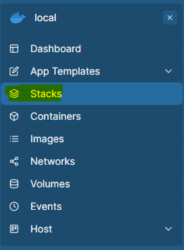
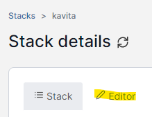
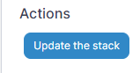
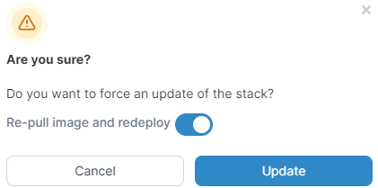

import { Callout } from 'nextra/components'
import { Steps } from 'nextra/components'
import { Tabs } from 'nextra/components'

# Updating Kavita

<Callout type="error">
Remember to use the new [Docker Central Repo!](https://hub.docker.com/r/jvmilazz0/kavita) The old repo `kizaing/kavita` is no longer supported!
</Callout>

<Callout type="warning">
	If you are updating from a any version before v0.7.6, you **MUST** upgrade every 2 versions at a time. Doing otherwise you risk to having to restart with a fresh database.
	
	Incremental upgrade order to prevent data loss (v0.5.6 > [v0.7.1.4](https://github.com/Kareadita/Kavita/releases/tag/v0.7.1.4) > [v0.7.3.1](https://github.com/Kareadita/Kavita/releases/tag/v0.7.3.1) > [v0.7.6](https://github.com/Kareadita/Kavita/releases/tag/v0.7.6) > [v0.7.14](https://github.com/Kareadita/Kavita/releases/tag/v0.7.14) > [latest](https://github.com/Kareadita/Kavita/releases/))
</Callout>

<Tabs items={['portainer', 'docker-compose.yml', 'docker run']}>

<Tabs.Tab>
As long as Kavita is in a 'stack' then updating is simple:

<Steps>

### Step 1
Go to your stacks on the left sidenav of portainer



### Step 2 

Go into your Kavita stack in the main listing of available stacks.

### Step 3 

Go to the editor tab



### Step 4



Go straight to the 'Update the stack' Button and click it. When the dialog box comes up asking "Are you sure?", check the box "Re-pull image and redeploy"



### Clean up

Don't forget to remove any orphaned images in the 'Images' tab so they don't keep taking up space. 

</Steps>
</Tabs.Tab>
  <Tabs.Tab>
Navigate to the location your compose file is at and run:

```bash
docker compose pull && docker compose up -d
```

This will pull the most recent image and bring the container back up.
  </Tabs.Tab>
  <Tabs.Tab>
```bash
docker compose pull
```

Then the same `docker run` command you used to bring up the service the first time.
  </Tabs.Tab>
</Tabs>