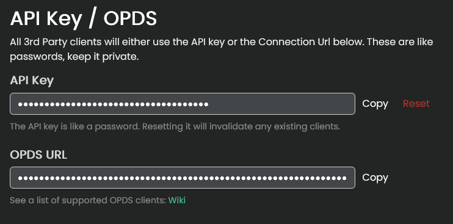

import { Callout } from 'nextra-theme-docs'

This section is for viewing or regenerating your API key and OPDS URL. 

## API key

<Callout type="error" emoji="️🚫">
  Do NOT give out your API key to anyone! Your API key is your username AND password rolled up into 1 string.  
  If someone has your key they can login as you! Only configure apps that you trust with your key.
</Callout>

This is your access key that can be used by apps to act on your behalf. Some user-made scripts and apps can login directly to your account using this key.

Check the [API](https://www.kavitareader.com/docs/api/#/) documentation to see what is possible 

### OPDS URL

If your Kavita admin has set the 'Hostname URL' setting, this will be filled out with your instance's hostname. If the 'hostname' isn't set then it will default to the address you are currently accessing it through. 
