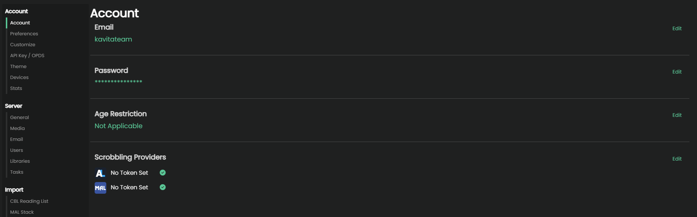

import { Callout } from 'nextra/components'

## Account Settings

#### Email

Allows you to change your email address. If you are using a 'username' only account you can set a new email for the first time, but you won't receive an email using this method. The admin user will have to go to the text file logs to get you a confirmation link to use.

Setting a new email requires supplying your current password.

#### Password

Use this to change your password. You need to supply your current password. As a user, if you have forgotten your password you can contact your Kavita admin and they can reset it for you.

#### Age Restriction

Displays your current age restriction, if set. Users that have the [Change Age Restrictions](../admin-settings/users.mdx#change-restriction) permission can change this here. 

#### Scrobbling Providers

This is for users to scrobble out outside providers that are supported by [Kavita+](../../kavita+.mdx). 

As of the time of writing only AniList is supported. 

<Callout type="info" emoji="ℹ️">
  If you know of other providers that have a public-facing API that allows scrobbling please let us know! We are always evaluating different services to see if they are a good fit for Kavita+
</Callout>