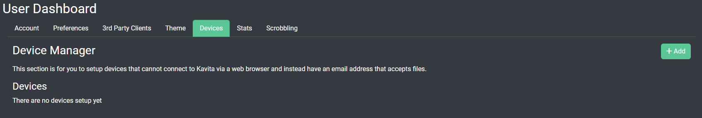
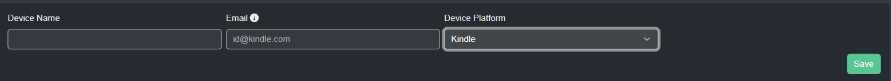
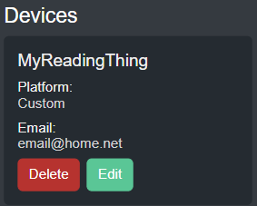

import { Callout } from 'nextra-theme-docs'

### Devices
<Callout type="info">
   Your Kavita admin needs to [configure Kavita for sending emails](../admin-settings/email.mdx) for this to work.
</Callout>

 This section is for you to setup devices that cannot connect to Kavita via a web browser and instead have an email address that accepts files. 
 
 You can setup predefined email addresses to use with kindles, kobo or pocketbook devices.

 ## Add Devices

 Click on `+Add` and fill out the infomation requested to setup send to device. 

 Device Name: What you want your device to be known as inside Kavita.  
 Email: The devices email address.  
 Device Platform: Select what kind of reader you have. For anything not listed you can pick 'Custom'

 ## Modify Devices

To modify and of your devices you can use the approiate buttons. Pressing edit will let you change the name, email or type of device. Pressing delete will remove the device. 