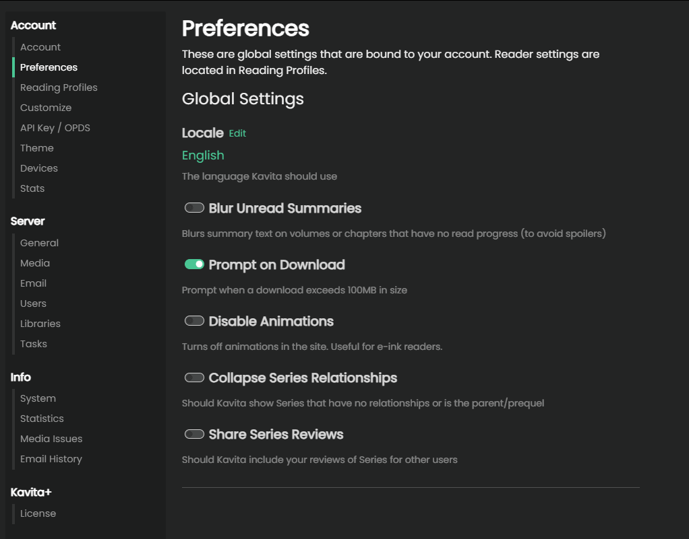

import { Callout } from 'nextra/components'
import Link from 'next/link'

## User Settings
To access the user settings page, which holds the all settings for the logged-in user, click on the settings gear and select the different options under the Accounts tab at the top. These settings apply to the logged-in user and will not affect any other user.

### Preferences
In this section, the user can configure site-wide preferences.

#### Reading Settings
Settings for each of the readers are now handled via reading profiles, learn more about them <Link href={`/guides/user-settings/reading-profiles`}>here</Link>.