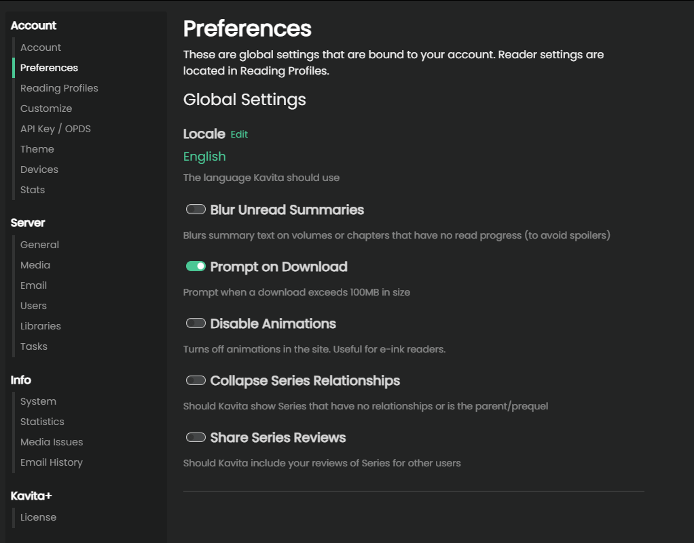

import { Callout } from 'nextra/components'

## User Settings
To access the user settings page, which holds the all settings for the logged-in user, you can use the nav bar dropdown on your username and select "User Settings". These settings apply to the logged-in user and will not affect any other user.

### Preferences
In this section, the user can configure site-wide preferences like default how the chapters/volumes are displayed (cards/list) or to blur the summaries descriptions.

#### Reading Settings
In the reading section, you will find all the options for the manga reader and the book reader. You can customize these as you like and they will apply on any of your devices. You can read more about each reader's setting [here (manga)](https://wiki.kavitareader.com/guides/webreader) and [here (book)](https://wiki.kavitareader.com/guides/bookreader).

