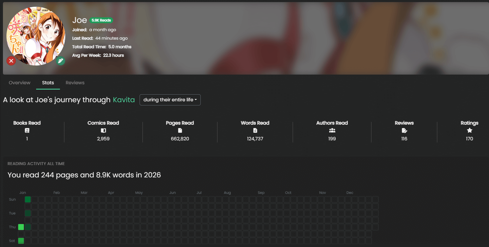
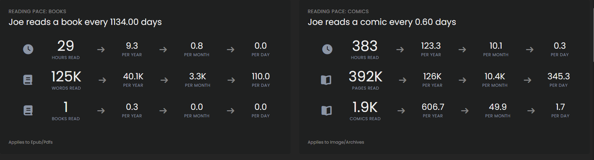

import { Callout } from 'nextra/components'

## Profile
<Callout type="info">
   Profile for all users is Opt-In!
</Callout>

Profile page allows for users to share their information with the server and also gain insights into their own reading activities. This screen is only visible to you unless you opt-into sharing 
your profile with the server (and reviews have their own control). 

