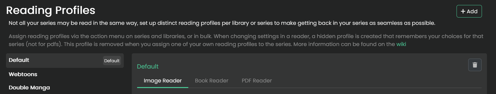

import { Callout } from 'nextra/components'

<Callout type="info">
    Reading profiles are part of the v0.8.7 release.
</Callout>

## Reading Profiles

Reading profiles allow you to have different reader settings per series or library. You can create as many reading profiles as you require, as long as the names are unique.

Once you've created your profile, you can bind it to a series or library. This is done via the actionables or bulk actions for series. A library or series can only have one reading profile bound at a time.

<Callout type="info">
    Your default profile is migrated from your user preferences. This profile can **not** be deleted or renamed.
</Callout>

### Settings

You can adjust all savable settings for each reader from the reading profile settings page, as well as inside the readers, more information on these can be found [here](../readers/comic-manga.mdx).
The following extra options can only be configured on the profile settings page:

**Disable width override**

When you're reading on a device with a smaller or equal width than the breakpoint you've selected, the width override will be disabled. The breakpoint values can be configured via your [theme](../themes.mdx#breakpoints).

### Implicit Profiles

When you make changes to a reader's settings while reading, Kavita will create an implicit profile for you. These profiles are **not** visible in your reading profiles settings.

From the reader, you can choose to:
- Create a new reading profile from the currently loaded implicit profile, which becomes visible in your settings and can be assigned to other series.
- Update the next profile in line to be selected for this series, ensuring it is up to date with its implicit profile.

Both actions delete the implicit profile.

<Callout type="info">
    Implicit profiles are removed when assigning a new profile to a series, or when clearing that series' reading profiles.
</Callout>

<Callout type="warning">
    Implicit profiles are not available for the PDF reader.
</Callout>

### Reading Profile Priorities

When opening a series, Kavita will automatically select the reading profile in the following order:

1. Implicit profile created for this series
2. The profile bound to a Device
3. The profile assigned to the series
4. The profile assigned to the library the series is part of
5. Your default profile