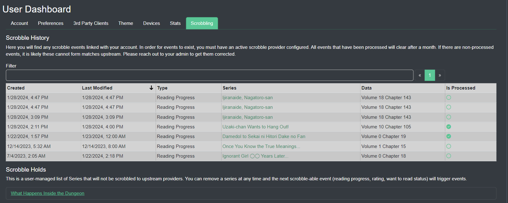

import { Callout } from 'nextra-theme-docs'

## Scrobbling
<Callout type="info">
   Scrobbling requires a [Kavita+](../../kavita+) subscritption and your personal user account to have an API key saved in [Scrobbling Providers](account.mdx)
</Callout>

#### Scrobble History

Here you will find any scrobble events linked with your account when using the Kavita+ feature. All events that have been processed will clear after a month. 

#### Scrobble Holds

Any series that you block scrobbling from on the series page will show up here as a hold. You can remove a series at any time and the next scrobble-able event (reading progress, rating, want to read status) will trigger events.