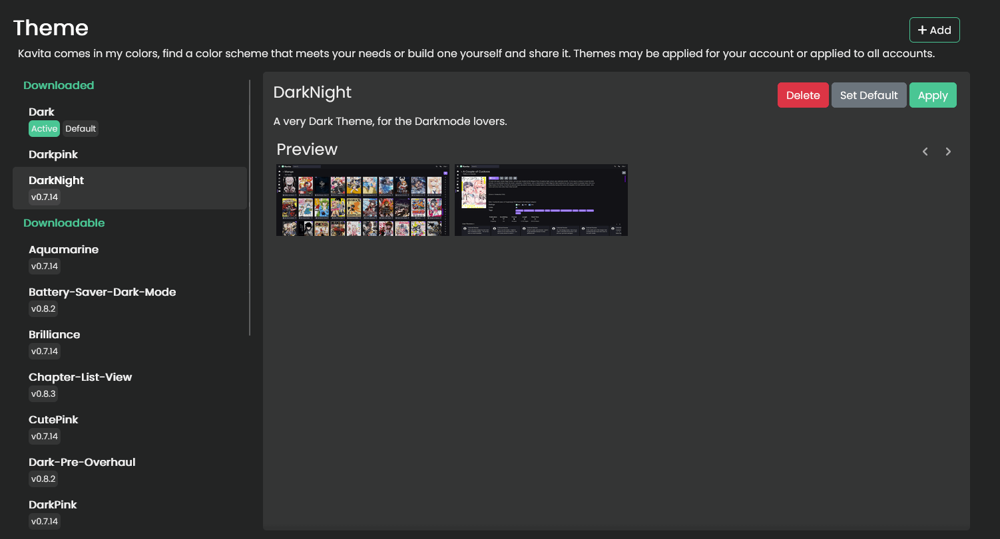

import { Callout } from 'nextra-theme-docs'

## Themes
If you are an admin, you can set the default theme for all users here. 

For normal users, you can pick from any of the available themes installed on the system. 

 Please [see the Themes page](../themes.mdx) for more info on how to make custom themes. 
 