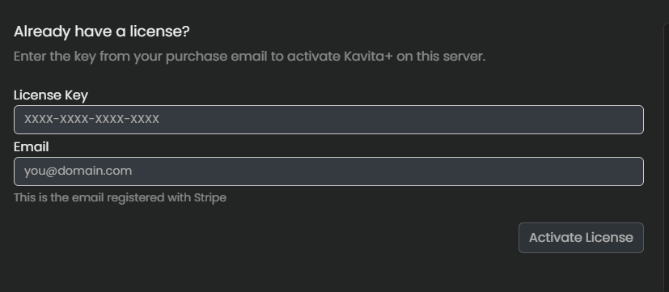

import { Callout } from 'nextra/components'

<Callout type="warning">
	Some users in China have reported issues being able to connect to Kavita+. At this time we are investigating possible workarounds. Follow the linked github issue for updates.
  
  一些中国用户报告了无法连接到 Kavita+ 的问题。目前，我们正在研究可能的解决方法。请关注此 GitHub 问题以获取更新。

  [https://github.com/Kareadita/Kavita/issues/3767](https://github.com/Kareadita/Kavita/issues/3767)
</Callout>

<Callout type="info">
  Cancel your subscription [here](https://billing.stripe.com/p/login/28oaFRa3HdHWb5ecMM). Uninstalling Kavita does not cancel your subscription. Reach out if you have any issues.
</Callout>

## What is Kavita+
Kavita+ is an **optional** premium service offered by the main developer of Kavita ([majora2007](https://github.com/majora2007)) which unlocks a set of features for your Kavita application. 
Kavita+ is a way for me to hopefully go full-time on Kavita development. Think of it as a way to support the development of Kavita while also getting some sweet features out of it. 

Kavita+ will only ever contain functionalities that are not feasible in the base product, like internet facing functionalities (metadata fetching, scrobbling, etc). No base-Kavita features will ever be locked behind a subscription.
The base Kavita application will continue to get frequent updates with new features. 

Kavita+ is a monthly subscription for your individual instance and is node-locked. Once active, all users on your server gain the benefit. You can cancel and resume at any time. 

<Callout type="info">
	 Kavita+ supports the latest 3 stable versions of Kavita. Anything outside that window is subject to not working. 
</Callout>

## Current Features
- [External Metadata](/kavita+/metadata) (Books/Comics/Manga/Light Novels)
  - Supports automatically fetching metadata from [Mangabaka](mangabaka.org?utm_source=Kavita), [Hardcover](https://hardcover.app/?utm_source=Kavita), and [ComicBookRoundup](https://comicbookroundup.com/)
  - Supports expanded metadata controls to control what data gets written based on **YOUR** rules [learn more]()
- [Scrobbling](/kavita+/progress-sync) (Progress Sync) 
  - Hardcover
  - MAL
  - AniList
  - MangaBaka
- External [Recommendations](/kavita+/recs-ratings-reviews#external-recommendations)/[Reviews](/kavita+/recs-ratings-reviews#external-reviews)/[Ratings](/kavita+/recs-ratings-reviews#external-ratings)
  - Mangabaka
  - Hardcover
  - MAL
  - ComicBookRoundup (user/critic reviews only)
- [Import MAL Stacks](/kavita+/smart-collections#mal-stack-import-and-sync)
- Remove Donate Link

## First-time Subscribers
If you are interested, you can use the promo code [`FIRSTTIME`](https://buy.stripe.com/00gcOQanFajG0hi5ko?prefilled_promo_code=FIRSTTIME) for your initial signup for a 2$ discount on the first month/year. If you are an active OpenCollective donator, please contact majora2007 for provisioning. 

## How to Buy
1. Navigate to Admin Dashboard -> Kavita+ tab. 
2. Click the buy button. If you already had a Subscription in the past, use the Manage -> Renew button.
3. A Stripe checkout window will collect your **read email** and payment information. The Kavita team does not have access to your personal information. 
4. Kavita will redirect to show you your new License Key and email you it. 
5. Kavita+ uses Stripe for managing financials. The Kavita team does not have any access to your personal information. You **must** use a valid email to receive your License Key. 
6. Move to Activate step

## How to Activate
1. From the Kavita+ settings page, fill in the same Email you signed up with and License Key.
2. Activate
3. Once activated, the Kavita+ License Management screen will show. Learn more [here](/kavita+/license-management)

**Uninstalling Kavita does not cancel your sub.** Contact majora2007 via email/[discord](https://discord.com/invite/b52wT37kt7) at any time if you have issues. 

