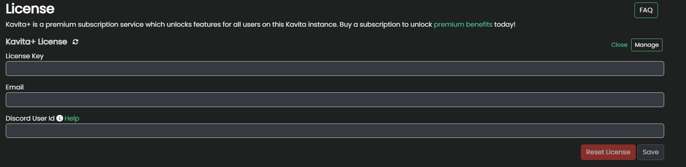

import { Callout } from 'nextra/components'

<Callout type="warning">
	Some users in China have reported issues being able to connect to Kavita+. At this time we are investigating possible workarounds. Follow the linked github issue for updates.
  
  一些中国用户报告了无法连接到 Kavita+ 的问题。目前，我们正在研究可能的解决方法。请关注此 GitHub 问题以获取更新。

  [https://github.com/Kareadita/Kavita/issues/3767](https://github.com/Kareadita/Kavita/issues/3767)
</Callout>

## What is Kavita+
Kavita+ is an **optional** premium service offered by the main developer of Kavita ([majora2007](https://github.com/majora2007)) which unlocks a set of features for your Kavita application. Kavita+ is a way for me to hopefully go full-time on Kavita development—think of it as a way to support the development of Kavita while also getting some sweet features out of it. The goal is to not lock all features behind Kavita+, but add features that otherwise aren't feasible in the base product. The base Kavita application will continue to get frequent updates with new features. 

Kavita+ is a monthly subscription for your individual instance and is node-locked. Once active, all users on your server gain the benefit. You can cancel and resume at any time. 

<Callout type="info">
	 Kavita+ supports the latest 3 stable versions of Kavita. Anything outside that window is subject to not working. 
</Callout>

<Callout type="info">
	Currently, only Manga/Light Novel metadata is supported. More Book-focused (and potentially comic) support is coming with [Hardcover](https://hardcover.app/) integration.
</Callout>

## Current Features
- Provide feedback on upcoming features (hidden channels)
- External Series for Admins
  - View Metadata within Kavita
- Remove Donate Link
- [Scrobbling](/kavita+/progress-sync)
  - AniList
- [External Reviews](/kavita+/recs-ratings-reviews#external-reviews)
  - AniList
  - MAL
- [Recommendations](/kavita+/recs-ratings-reviews#external-recommendations)
  - AniList
  - MAL
- [External Ratings](/kavita+/recs-ratings-reviews#external-ratings)
  - AniList
  - MAL
- [Import MAL Stacks](/kavita+/smart-collections#mal-stack-import-and-sync)
- [External Metadata Support](/kavita+/metadata)
  - Ability to automatically download rich metadata for your media without having to tag things yourself

## Planned Features
- Non-manga Book (and limited Comic) Support
  - [Hardcover](https://hardcover.app/) (planned for when their API is more stable)
  - [Metron](https://metron.cloud/) (planned for when their catalogue is larger)
- Webhook Support
- Find non-owned series by Person (like Authors)
- Community-Driven Proposed Features (you can submit your ideas [here](https://github.com/Kareadita/Kavita/discussions/2529))

## First-time Subscribers
If you are interested, you can use the promo code `FIRSTTIME` for your initial signup for a 2$ discount on the first month/year. If you are an active OpenCollective donator, please contact majora2007 for provisioning. 

## How to Buy
Navigate to Admin Dashboard -> Kavita+ tab. From there, you can purchase a license via the Buy button. A new tab will open prompting you for your pay information. Kavita+ uses Stripe to handle payments. The Kavita team does not have any access to your personal information. Please ensure you use a real email, otherwise you will not be able to receive your product key. Upon finishing your subscription, you will receive an email from Kavita with your license key. Move to the Activate step.

## How to Activate
From the Admin Dashboard -> Kavita+ tab, press the Activate button. This will prompt you for the email you used with Stripe and the License you received via the email. Enter the details and hit save. This will register your Kavita instance with Kavita+ and should reflect instantly. If you ever need to manage your subscription, like cancel it, you can do so via the Manage button. All management is locked around your email. If for whatever reason your license is showing invalid, use the Check button to re-validate the license.

## How to Unsubscribe
If Kavita+ isn't bringing value to you, you can unsubscribe easily via the Kavita+ Tab. Click Manage which will open your Stripe portal and from there you can cancel your membership. You will receive an email stating your subscription has been canceled and when your Kavita+ membership lasts. You can use this Manage button at any time in the future to re-activate your subscription. If in doubt, please reach out to [majora2007](https://discord.com/invite/b52wT37kt7).