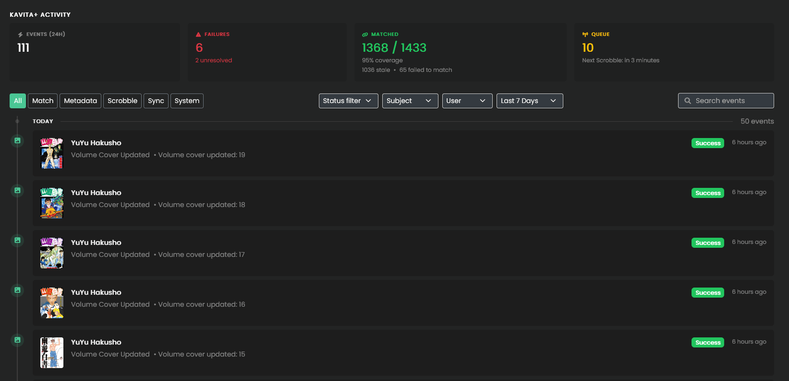
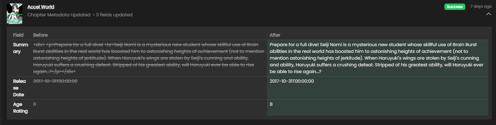
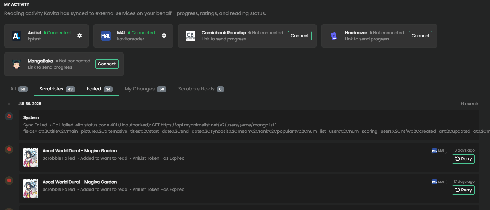

# Audit: Understanding What Kavita+ is doing

In order to help understand what Kavita is doing with Kavita+ metadata, scrobbling, syncing (Smart Collections), etc, Kavita has the Kavita+ Activity screen. 

This is a one-stop-shop that streams all Kavita+ activity for the system (all users) and provides filters for the Acitivity Type (Match, Metadata, Scrobble, Sync, System), 
Status (Success, Status, Failure), Subject (underlying entity like Series, Volume, etc), User (if applicable), and a timeframe, along with a loose search to help narrow down. 

Match types allow you to override instantly in the case of a bad match. Metadata events will also show a diff of what updated from -> to.

## My Activity

This screen narrows down to **YOUR** activity (primarily scrobble and Smart Collection Syncs) and is visible for non-admin's as well. 

