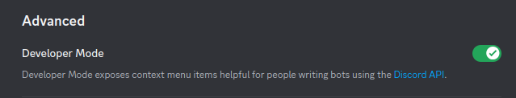
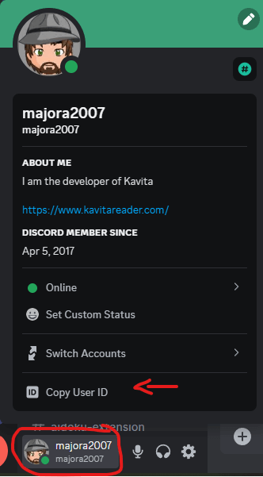

## Discussion Items
Kavita+ features are usually discussed in the discord, however I have some Github issues open and am looking forward to information from the community before moving forward. If you want to discuss, please leave a comment there.
- [Paused/Dropped Scrobble status](https://github.com/Kareadita/Kavita/issues/2447)
- [Basic Metadata Matching](https://github.com/Kareadita/Kavita/issues/2452)

## Kavita+ Frequently Asked Questions

#### How to fix bad Matches
As series can often have many names and users may put their own spin on each one, scrobbling might fail to match. '
In these cases, there are two options: Correct the Series name or Localized Series name to match AniList or add AniList or MAL weblink to the series. 
Once done, you can clear scrobble errors and wait. Scrobbling should take after this. 
You may also want to bust cache:
- v0.7.14+: Open the edit series and press `Force Refresh`
- others: In Admin -> Tasks, which will clear bad rating, recommendation, and review data for all your users.

#### Some reviews look broken
This happens due to a bug in AniList's API. I have created an issue and will monitor. This should be rare and you can use Open Review button to read the review in AniList. MAL reviews do not seem affected.

#### Some series cannot be found
This can happen if AniList doesn't have the series (or you need to rename/add a weblink). If AniList doesn't have a series, you can work with them to add the series. 

#### I don't see any ratings, reviews, or recommendations
As of Kavita v0.7.4, only series that exist on AniList will provide external data. I am actively scouting for Comic and Book providers (hardcover POC planned) to provide more information. If you think you have something I can integrate with, please raise it on the feature request site.

#### AniList activity feed isn't showing my progress
AniList currently doesn't show activity if only Volumes were read. You can read more about it [here](https://anilist.co/forum/thread/2586). You can validate that the Volumes do update in the Series on AniList. 

#### License already tied to another server
This can happen when you change hardware, OS, or re-install Kavita. As of version v0.7.13 you can reset your own license by going to the [Kavita+ tab](../guides/admin-settings/kavita+.mdx) and using the Reset button then Save to retie your server.

#### I have a cool idea for Kavita+
Like all ideas with Kavita, please raise it on the [github features discussions](https://github.com/Kareadita/Kavita/discussions) and allow the community and I to expand on it and prioritize it. 

#### Discord Id
If you want access to channels in the discord server for Kavita+ users, you need to link your Discord user id with your Kavita+ license. Under the Kavita+ tab, you can do this. Note, this is your discord user id number, not your discord username. 

To do this, go to Discord Settings > Advanced and turn Developer Mode ON.

From your user profile on the bottom left, you can click and get your user id. It should be a list of numbers.
