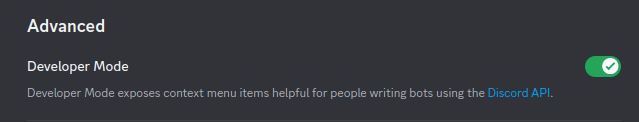
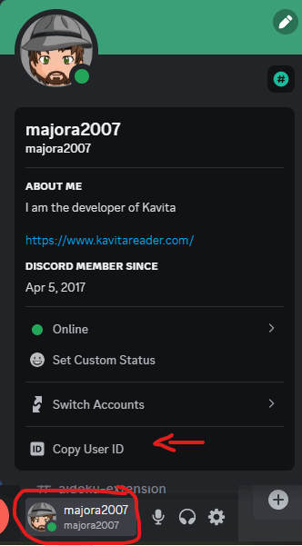

## Discussion Items
Kavita+ features are usually discussed in the discord, however, I have some Github issues open and am looking forward to information from the community before moving forward. If you want to discuss this, please leave a comment there.
- [Paused/Dropped Scrobble status](https://github.com/Kareadita/Kavita/issues/2447)

## Kavita+ Frequently Asked Questions

#### How to fix bad Matches

v0.8.5:
Use the Match action item on Series detail page.

#### Some reviews look broken
This happens due to a bug in AniList's API. I have created an issue and will monitor it. This should be rare and you can use the Open Review button to read the review in AniList. MAL reviews do not seem affected.

#### AniList activity feed isn't showing my progress
AniList currently doesn't show activity if only Volumes were read. You can read more about it [here](https://anilist.co/forum/thread/2586). You can validate that the Volumes do update in the Series on AniList. 

#### License already tied to another server
This can happen when you change hardware, OS, or re-install Kavita.
 - v0.7.13, you can reset your license by going to the [Kavita+ tab](../guides/admin-settings/kavita+.mdx) and using the Reset button then Save to retie your server.
 - v0.8.5, Kavita will prompt you if you want to overwrite. Select yes.

#### I have a cool idea for Kavita+
Like all ideas with Kavita, please raise it on the [GitHub features discussions](https://github.com/Kareadita/Kavita/discussions) and allow the community and I to expand on it and prioritize it. 

#### Discord Id (pre-v0.9.1)
If you want access to channels in the Discord server for Kavita+ users, you need to link your Discord user ID with your Kavita+ license. Under the Kavita+ tab, you can do this. Note, that this is your discord user id number, not your discord username. 

To do this, go to Discord Settings > Advanced and turn Developer Mode ON.

From your user profile on the bottom left, you can click and get your user id. It should be a list of numbers.
