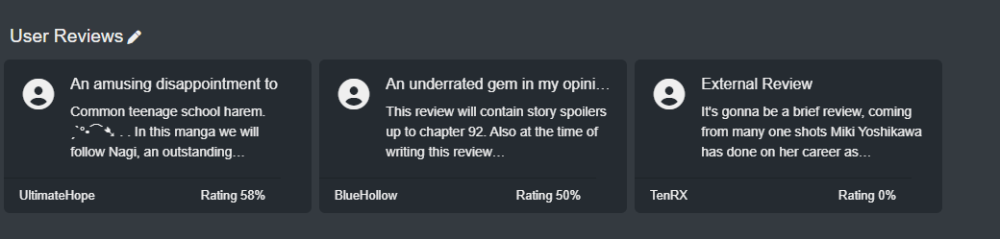
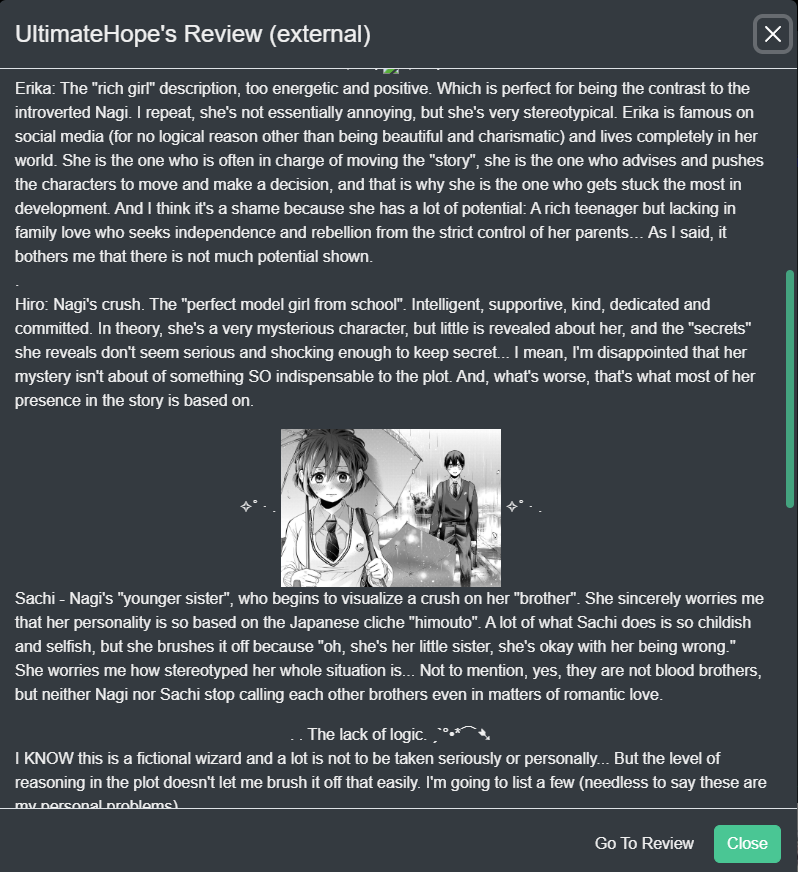
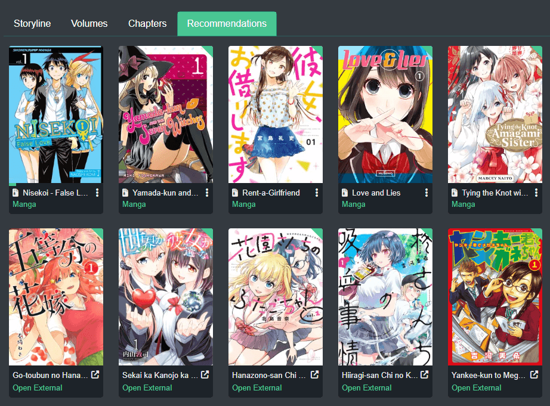
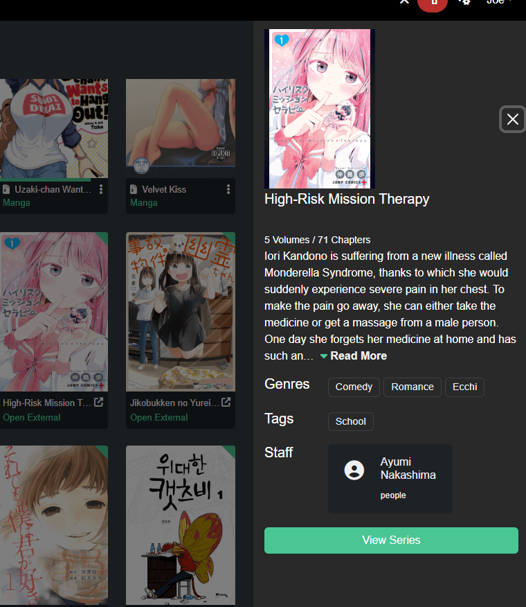
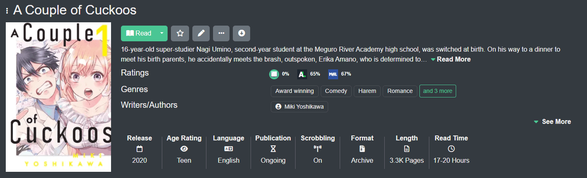
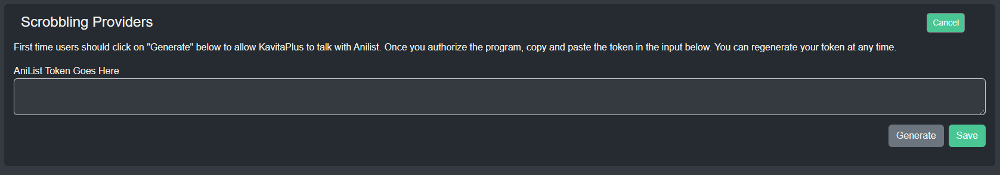
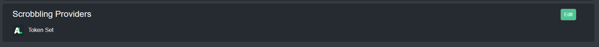
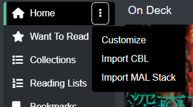
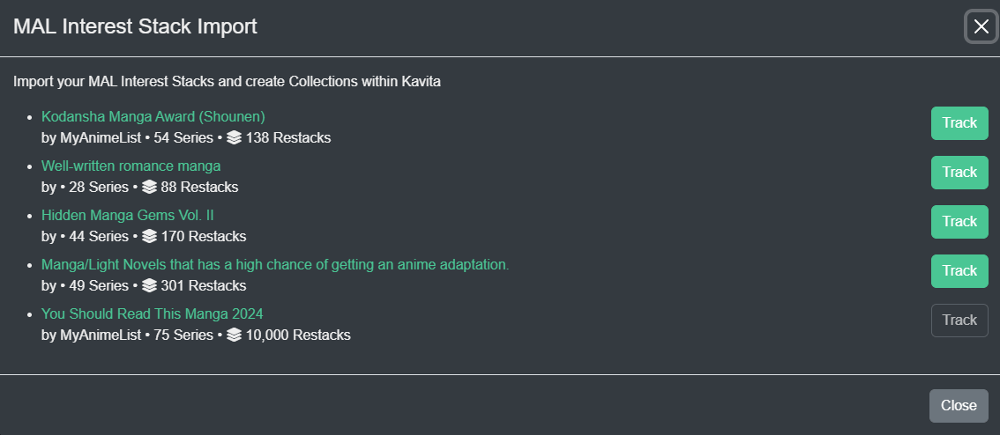
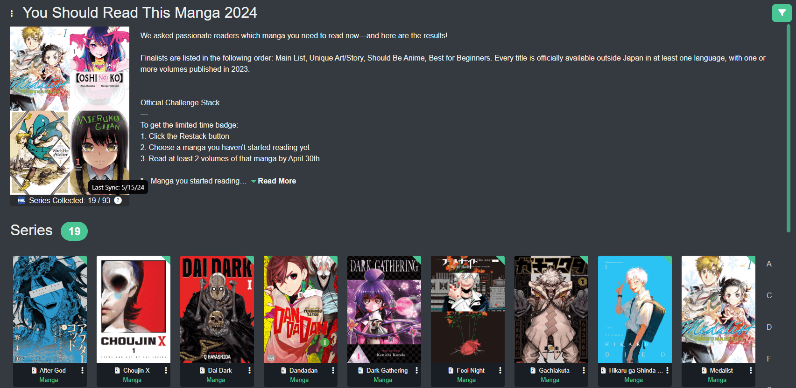

import { Callout } from 'nextra-theme-docs'

# Kavita+ Features

<Callout type="info">
	Currently, only Manga metadata is available for External Review/Ratings/Scrobbling. More Book-focused (and potentially comic) support is coming with [Hardcover](https://hardcover.app/) integration.
</Callout>

#### External Reviews
Kavita+ offers external reviews on the Series Detail page. These reviews are aggregated from multiple sources and sorted to try and provide a spectrum of positive, mid and negative reviews. 
If users on your server have opted into sharing their reviews, they will always show first, then reviews from external sources. Clicking on any review will show you the external review.

  

#### External Recommendations
Kavita+ offers external recommendations on the Series Detail page. The recommendations are aggregated from multiple sources. If the logged-in user is an admin with no age restriction, they will be able to see recommendations that are not on the server, otherwise, only series on the server will show (and the usual age restriction or library restriction will apply). 

#### External Ratings
Kavita+ offers external ratings. For now, they are just limited to viewing but may be integrated into activity streams in the future. Here you can see the ratings displayed alongside your own review (or lack thereof).

#### Scrobbling
Scrobbling is the act of synchronizing certain activities done on a Server, like Kavita, to an upstream provider. As of launch, Kavita+ supports AniList for scrobbling and supports the following events:
- Reading Progress
- Want to Read -> Adds a series to Planning
- Rating a series -> Will map to your rating preferences

To set up Scrobbling, navigate to your User Settings -> Account tab and click Scrobbling. You can add a token for the scrobble provider. You should see a Generate button. This will generate a token for you. Copy and paste this into Kavita and hit save. Once your token is validated, Kavita will show it as set. Tokens are per-user and Kavita will automatically keep them fresh for you. 

If you do not want scrobbling on a library, as an admin, you can turn it off in Library Settings. If as a user, you want to exclude certain series, you can do that by pressing the scrobbling button on the Series detail page. If you had a series on the scrobble hold list (visible in User Settings -> Scrobbling) and turned it on again, you need to invoke a reading event or rating event, based on whatever you want to scrobble up. You can simply open the reader, go back a page and forward or re-mark an existing item as read.

Scrobbling will always ensure the highest between AniList and Kavita is taken. So if AniList has 10 volumes read and Kavita reports 5, nothing will change. This is to ensure users that who use multiple services or have an existing history not brought into Kavita do not have any issues with their histories. 

<Callout type="info">
	 Kavita will scrobble once every 4 hours to AniList. This period is not adjustable.
</Callout>

#### MAL Stack Import (and sync)
Kavita+ allows any user to import their MAL stacks and restacks from their account into Kavita. Kavita will build a collection that syncs **every 2 days** with the upstream MAL stack. 

<Callout type="info">
	 Kavita will synce once every 2 days to MAL. This period is not adjustable.
</Callout>

