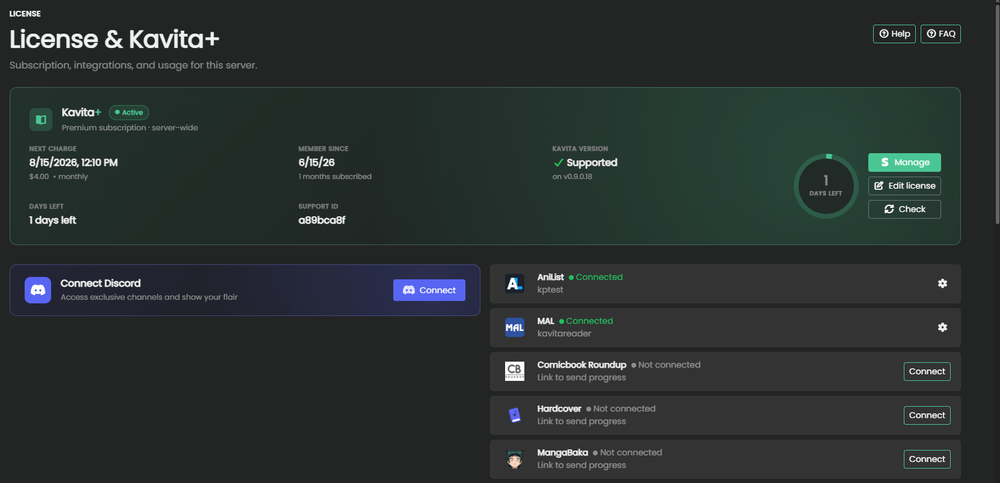
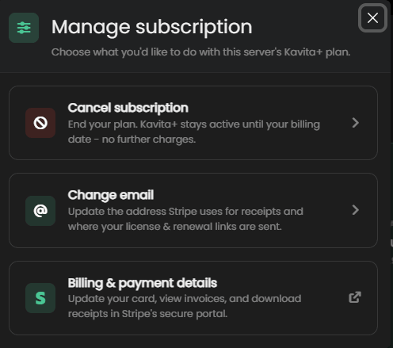
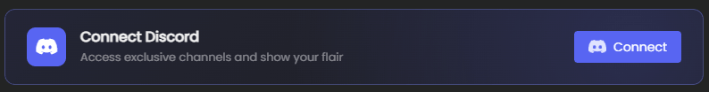
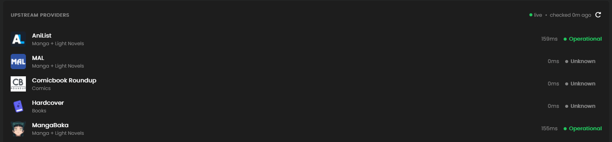
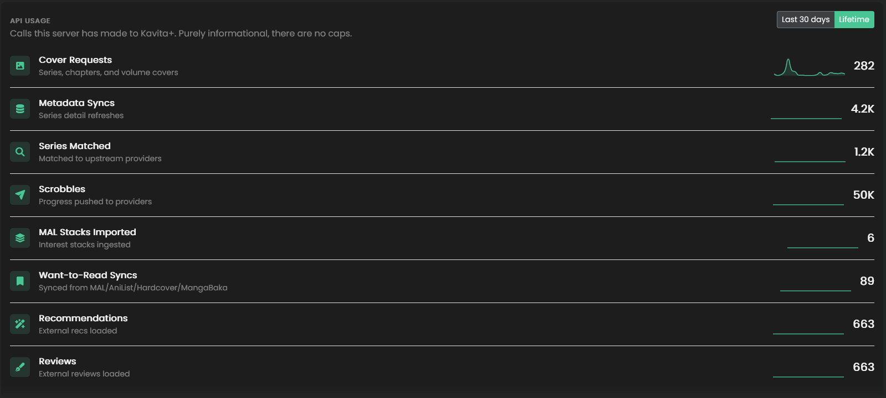

# Management

### Manage Subscription

This panel provides information about your current subscription, when the next charge will be and how many days left, if you're on a supported version of Kavita, and a support id to help coorelate logs to your account.

From here, you can edit your licesnse (same as activate flow), recheck status, and Manage: Cancel, Change Email, Update Billing via Stripe. 

### Discord

You can connect your discord via OAuth. This will grant you a flair in our discord server and access to some hidden channels for discussing upcoming features or giving feedback.

### Upstream Provider Health

An at-a-glance panel to understand if upstream metadata providers are experience downtime. AniList has historically experience downtime often. This helps you understand why some scrobbles might fail or you're missing staff information.

### API Usage

This provides an understanding of the **value** you are getting from Kavita+. This is purely informational and does not represent any caps. 

