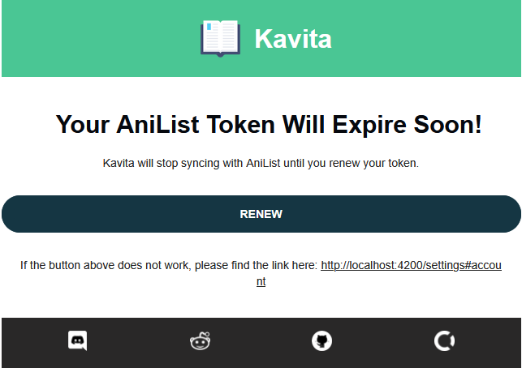

# Management

## License Management

### How to Buy
Navigate to Admin Dashboard -> Kavita+ tab. From there, you can purchase a license via the Buy button. A new tab will open prompting you for your pay information. Kavita+ uses Stripe to handle payments. The Kavita team does not have any access to your personal information. Please ensure you use a real email, otherwise you will not be able to receive your product key. Upon finishing your subscription, you will receive an email from Kavita with your license key. Move to the Activate step.

### How to Activate
From the Admin Dashboard -> Kavita+ tab, press the Activate button. This will prompt you for the email you used with Stripe and the License you received via the email. Enter the details and hit save. This will register your Kavita instance with Kavita+ and should reflect instantly. If you ever need to manage your subscription, like cancel it, you can do so via the Manage button. All management is locked around your email. If for whatever reason your license is showing invalid, use the Check button to re-validate the license.

### How to Cancel/Update Payment information
If Kavita+ isn't bringing value to you, you can cancel easily via the Kavita+ Tab. Click Manage which will open your Stripe portal and from there you can cancel your membership. You will receive an email stating your subscription has been canceled and when your Kavita+ membership lasts. You can use this Manage button at any time in the future to re-activate your subscription. If in doubt, please reach out to [majora2007](https://discord.com/invite/b52wT37kt7).

## Feature Management

## Matched Metadata
To gain an understanding of any matching issues (affects both metadata and scrobbling), you can use the `Matched Metadata` page to bring up a table 
showing all series and their underlying status. 

## User Tokens
When users on the server use Progress Sync (Scrobbling), their tokens expire sometimes. As of v0.8.5, if SMTP is setup and the user has a valid email, 
Kavita will email them to refresh their tokens twice before the token expires. In the case that nothing is refreshed, scrobbling will stop working. 

Admins can use this screen to keep an eye on their users and help nag them when they will be impacted. 

