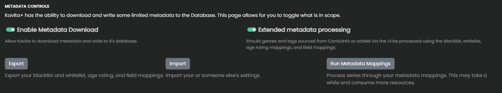
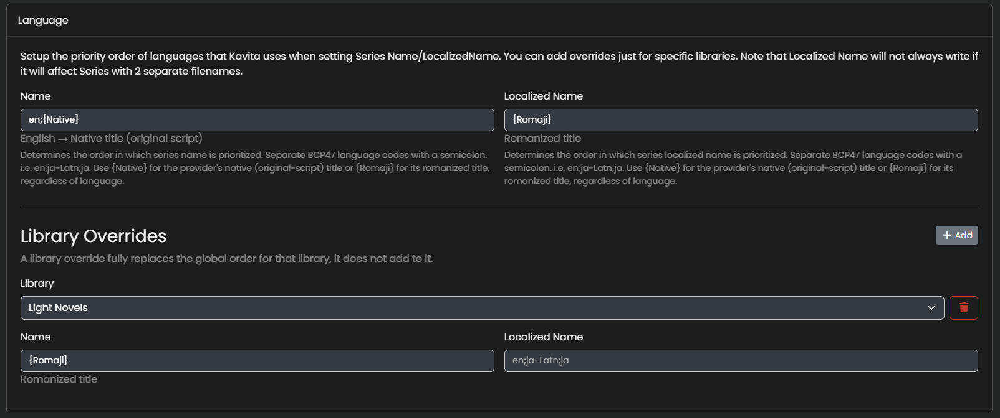
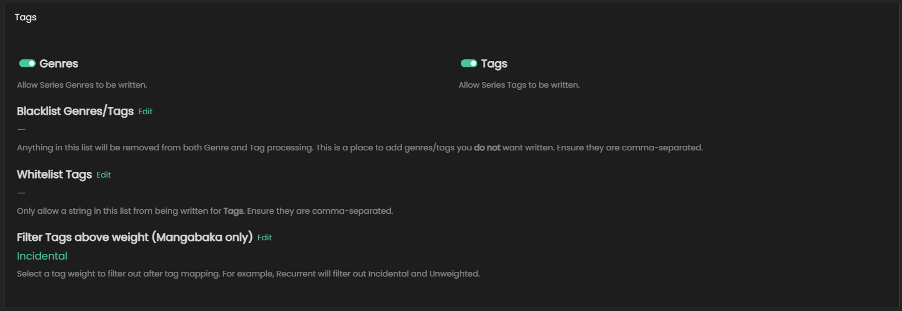
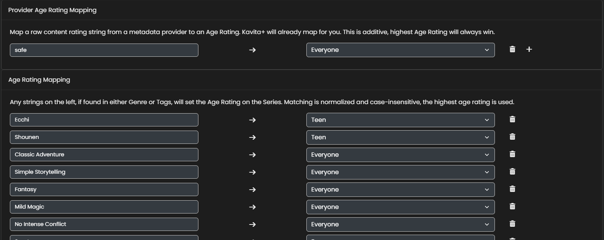
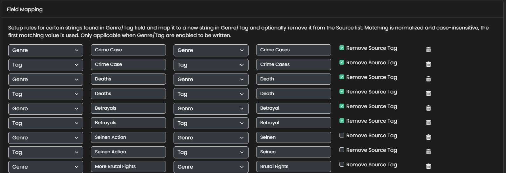

# Metadata Controls

Having access to external metadata for Books, Comics, and Manga is great, but not if it populates your server with irrelevant junk tags or messes with your Age Ratings, that's why Kavita has a powerful set of controls to currate what is actually done with external metadata.

There are many different sections to this, not all sections will include images.

## Global Settings

This section covers enabling the ability to download external metadata for the server as-a-whole (you can always override at the library-level) and if file-based metadata (ComicInfo, PDF, opf) should flow through this system. 

In addition, you can import/export your settings into a json and share/tweak them. Lastly you can re-run all your data through the mappings. Great if you've tweaked a few settings.

## Series Name and Localized Name

Kavita has the ability to update the Series Name/Localized Name based on language codes from Mangabaka and Hardcover. You can configure a set of fallbacks per-field and library specific overrides.

In the example picture, I have:
Series Name: `en;{Native}`
Localized Name: `{Romaji}`

with one library override for Light Novels:
Series Name: `{Romaji}`
Localized Name: `` (empty, don't touch)

Kavita will try to write English then the Native title for the Series and the Romanized title for the Localized Name. Note: Kavita will not write Localized Name if it's being used to combine 2 series names into 1 series on disk. 

## Series fields

This section dictates what fields Kavita can write to. You have the following options:
- Summary
- Series Name
- Localized Series Name
- Age Rating
- Publication Status
- Relationships
- Start Date
- Cover Image

## Chapter/Issue fields

This section dictates what fields Kavita can write to for the Chapter (lowest level item). You have the following options:
- Title
- Summary
- Release Date
- Publisher
- Chapter Cover

## Volume fields

Like the above sections, this is for Volumes (note: A volume made up of 1 chapter inherits the metadata automatically). You have the following options:
-  Volume Cover

## People

This section dictates how People (Writer/Aritst/Character) are created and written. YOu can turn it on/off and configure if you want `FIRST LAST` naming convention. People from Kavita+ come with images when available.

## Tags

Allow Kavita to write Tags and/or Genre toggles live here. If you allow it, Kavita can do quite a few things:

1. Whitelist - Allow only the strings in the whitelist to be written as Tags
2. Blacklist - Remove these strings from any Tags and Genre fields. This runs AFTER [Field Mapping](#field-mapping)
3. Filter Tag weight - Mangabaka weighs different tags based on how much they affect a series (Core, Defining, Incidental, etc). You can filter out all tags **ABOVE** your selection. This runs **AFTER** Tag Mapping.

## Age Mapping

There are 2 main controls here:
1. Raw Age Mapping - Upstream metadata providers set age ratings and Kavita+ translates them a safe guess. (ie "safe" -> Everyone). If you disagree, you can add a rating "safe" -> "G" and Kavita will use your mapping instead.
2. Tag/Genre Mappings - Setup any string -> Any Age Rating. If Kavita finds the string in Tags or Genres, it will set the Age Rating. 

Kavita will utilize the existing rating (file-based metadata), Raw/Kavita+ Age Rating and the Highest from Tag/Genre mapping and pick whatever is the highest for the Series. 

## Field Mapping

This section is all about transforming Genres/Tags into the exact system you want. To achive this, you setup rules that state:

`Source Field (tag) of Name (Volleyball) becomes Target Field (Tag) named (Sports) and the Source value is removed.`

This is a powerful system that allows you to craft tags/genres however you want. This runs BEFORE whitelist/blacklist. 

## Overrides

By default, Kavita will not write over Locked fields. This section grants it permission. This section contains all the items listed above.
