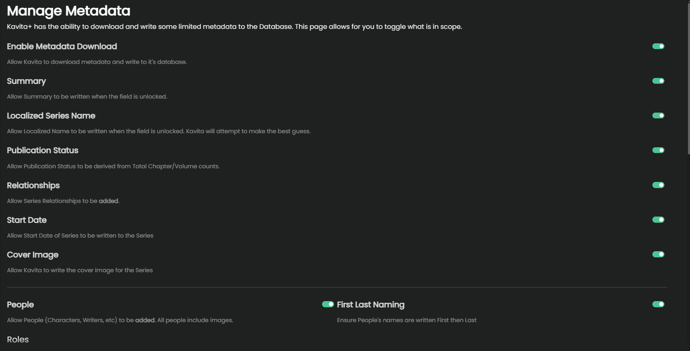
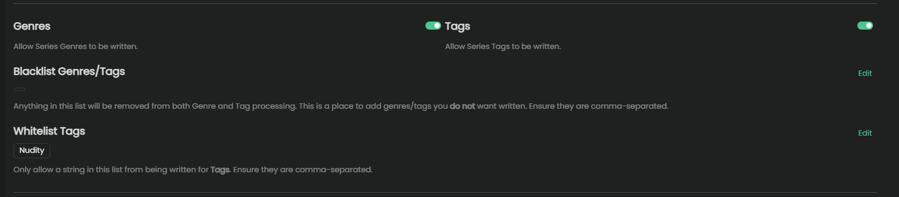
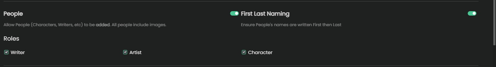
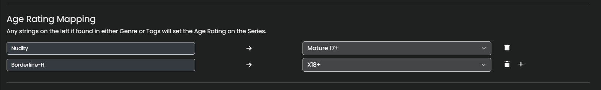
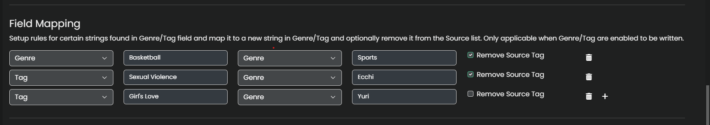
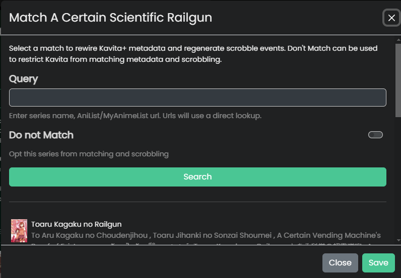

import { Callout } from 'nextra/components'

# Basic Metadata

Kavita+ allows for users to download metadata from AniList and perform a level of customization around the experience. This feature is not meant to be extensive and meet all users needs, but 
to capture the majority of needs. Hardcover/Metron may be expanded to for this feature in the future. 

Kavita can write to the following fields:
- Summary
- Release Year
- Localized Name
- Publication Status
- Genres
- Tags
- Age Rating
- Writers, Cover Artists, and Characters
  - Includes description and cover image
- Series-to-Series Relationships
- Series-level Cover Image

Kavita will not overwrite your metadata based on:
1. If the setting is on/off
2. If the underlying field is locked AND there is no override setup

## Genres/Tags
Genres and Tags work differently than other fields:

1. Field mapping is applied to Genre/Tag list. If `Source Removed` is selected, the item will be removed from the list.
2. Both Genres and Tags will pass through Blacklist list and any blacklisted items will be removed.
3. Tags will pass through the whitelist if applicable and only whitelisted strings will be kept.
4. If the setting is enabled, the process will continue. If not, these processed genres/tags will be used in the `Age Rating Mapping` step.

There is no ability to not have Genres/Tags apply unless the whole flow is disabled. Existing Genres/Tags will be overwritten by the incoming Genres/Tags. 

#### Blacklist
Setup a list of genre/tags you do NOT want to write to your Series. This is the last step in the process.

#### Whitelist
Setup a list of tags you ONLY want to write to your Series. This is the last step in the process.

## People
People by default will not be removed from a metadata match if there is no match. Kavita however will remove people from a bad match previously.

You have the ability to control the naming pattern to use and which people roles you want to be written. Kavita will backfill existing people with metadata (description/cover image). 

## Cover Image
Cover Image, if enabled, will do an additional check to avoid replacing a good cover with a lower resolution cover. Kavita will check if the cover is at least 70% similar and if so will take the file with the better resolution.

## Age Rating Mapping
This allows you to setup any sort of tag/genre in the metadata to trigger an age rating to be derived. The highest rating will be taken in the case of multiple matches.

## Field Mappings
Field Mappings allow for you to configure when certain genres/tags are present to rewrite them into something different, where that should be set, and Kavita should remove it from the source list.

In the example below, I told Kavita whenever the Genre of `Basketball` is present, to remove it from the Genre and instead add `Sports`. 
I also wanted the Tag `Girl's Love` to be rewritten to `Yuri` as a Genre, but leave the tag in the source list. This means my Genres would be "Yuri" and Tags as "Girl's Love".

<Callout type="info">
	You can find a list of different Genres/Tags from [here](https://anilist.co/forum/thread/4824)
</Callout>

## Don't Match
Some series you might not want to attemp to match or get external metadata written to it. Don't Match can be set from the Series -> Match actionable. 

