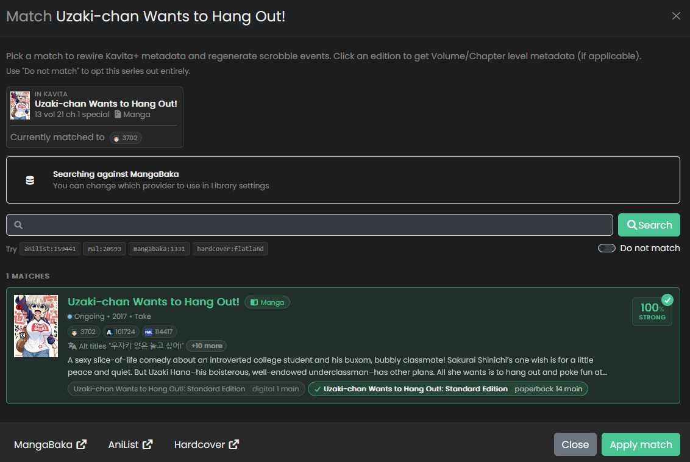
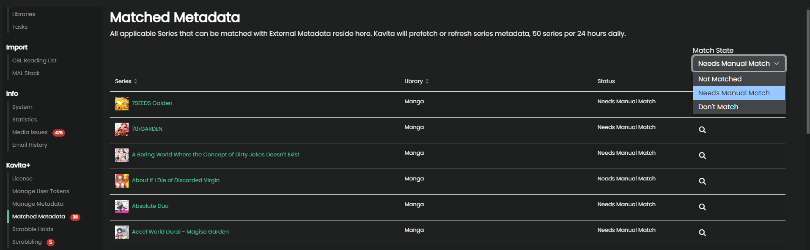

import { Callout } from 'nextra/components'

<Callout type="info">
  Learn about what fields Kavita can write and how to control them [here](/kavita+/metadata-controls)
</Callout>

Kavita+'s primary feature is downloading metadata for you, to avoid manually tagging your files. This feature is not meant to be extensive and meet all users needs, but 
to capture the majority of needs.

## Media Types

Kavita supports:
- Hardcover: Books, Light Novels, some light comics
- ComicBookRoundup: Comics, follows Comic vine's naming structure
- Mangabaka: Manga, OEL, Webtoons, etc 

This means Kavita+ can support all media types out of the box. 

## How Matching Works

By default, Kavita will perform 50 metadata matches/refreshes per day. Any ad-hoc requests done via the UI are excluded from this limit. 

A match is auto selected if there is exactly one 100% match, or if there is exactly one match scored 90% or higher. Any match failures will be put into a state where the admin needs to resolve. You can do that from Manage Metadata settings page or using the Match Modal.

### Manual Match

From Series Actionable menu, you can trigger the `Match` modal to Fix an incorrect match, repull metadata, or tell Kavita to stop matching a series (opts out of scrobbling). 

In the example here, you can see that Kavita+ is searching against Mangabaka for a manga and that there is one result. Within this series are 2 editions (editions have different Volume metadata, description, and covers). 
I've selected the edition `paperback` which will attempt to download higher quality covers along with metadata. Some editions have different volume counts (Omnibus) and will affect Publication Status.

I can also set **Do Not Match**. This tells Kavita to stop trying to match this series and will also stop Scrobbling against it for all users. 

## Matched Metadata
To gain an understanding of any matching issues (affects both metadata and scrobbling), you can use the `Matched Metadata` page to bring up a table 
showing all series and their underlying status. 

## Relationships

Kavita maps MangaBaka relationship types to the closest supported Kavita relationship kind.

| MangaBaka Relationship           | Kavita               |
|----------------------------------|----------------------|
| `Adaptation`                     | `Adaptation`         |
| `Alternative`                    | `AlternativeSetting` |
| `Cameo`                          | `Cameo`              |
| `CharacterFocus`                 | `Cameo`              |
| `Compilation`                    | `Compilation`        |
| `Contains`                       | `Contains`           |
| `Crossover`                      | `Other`              |
| `Expansion`                      | `AlternativeVersion` |
| `Main`                           | `Parent`             |
| `Parent`                         | `Parent`             |
| `Parody`                         | `Doujinshi`          |
| `Prequel`                        | `Prequel`            |
| `Reboot`                         | `AlternativeVersion` |
| `Remake`                         | `AlternativeVersion` |
| `Sequel`                         | `Sequel`             |
| `Series`                         | `Series`             |
| `SideStory`                      | `SideStory`          |
| `Source`                         | `Source`  (Ignored)  |
| `SpinOff`                        | `SpinOff`            |
| `Summary`                        | `AlternativeVersion` |
| `Uncollected`                    | `Other`              |
| Any other / unknown relationship | `Other`              |
