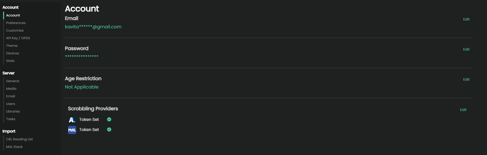
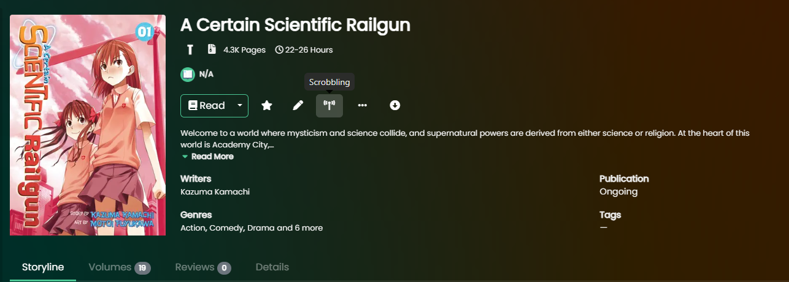

import { Callout } from 'nextra/components'

# Progress Sync (Scrobble)
Scrobbling is the act of synchronizing certain activities done on a Server, like Kavita, to an upstream provider, like AniList. Currently, Kavita+ supports AniList for scrobbling and supports the following events:
- Reading Progress
- Want to Read -> Adds a series to Planning
- Rating a series -> Will map to your rating preferences

#### Setup

1. Navigate to Account Preferences under Settings.

2. Click Scrobbling Providers -> AniList -> Genenrate. 
3. This will generate a token for you. Copy and paste this into Kavita and hit save. Once your token is validated, Kavita will show it as set. Tokens are per-user and Kavita will automatically track when they need renewal for you.
4. Optionally you can add a MAL token for [Smart Collections](./smart-collections) or [Want to Read Sync](.smart-collections)
5. Press Save. Your screen should look like the first image.

<Callout type="info">
	The first time you enter an AniList token, you will be prompted to generate scrobble events based on existing history. You can defer this to later and use `Backfill Events` on Scrobbling screen.
</Callout>

#### Scrobble holds
Scrobble Holds tell Kavita not to process anything around a Series with a hold on it. You can toggle on/off the Scrobble hold system by clicking the button in the screenshot. 

You can view all scrobble holds on the Scrobbling Holds page.

#### Restrictions
Kavita will not perform scrobbling under the following conditions:
- A previous scrobble attempt was made and the series was not found (Series is Blacklisted - Fix the match in [Matched Metadata](./manage#matched-metadata))
- The series has Don't Match set (Series -> Match -> Don't Match)
- The series has a Hold on it (user-specific scrobble hold)
- The library of that series has Scrobbling off (for all users)

Scrobbling will always ensure the highest between AniList and Kavita is taken. So if AniList has 10 volumes read and Kavita reports 5, nothing will change. This is to ensure users that use multiple syncing services or have an existing history will not have issues.

<Callout type="info">
	 Kavita will scrobble once every hour. This period is not adjustable.
</Callout>