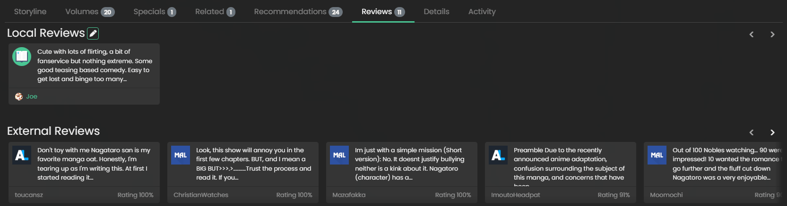
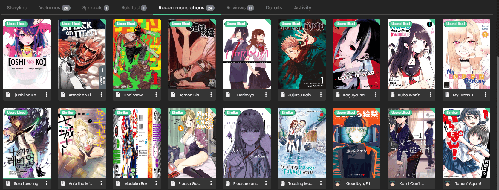
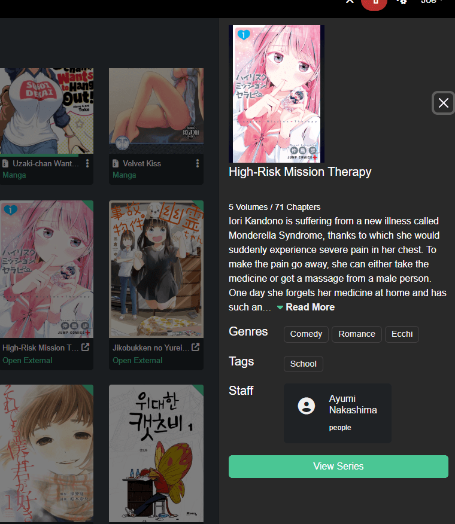
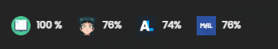

import { Callout } from 'nextra/components'

# Recommendations, Ratings & Reviews

Kavita+ will pull external reviews (critic/user for Comics, user for all others), Average Ratings, and Recommendations. Recommendations will show for all users and respect their Age Rating settings.

### External Reviews

Kavita+ offers external reviews on the Series Detail page. These reviews are aggregated from multiple sources and sorted to try and provide a spectrum of positive, mid, and negative reviews. 
If users on your server have opted into sharing their reviews, they will always show first, then reviews from external sources. Clicking on any review will show you the external review.

### External Recommendations

Kavita+ offers external recommendations on the Series Detail page. The recommendations are aggregated from multiple sources. 
Recommendations are currently only available from Mangabaka and will respect the user's Age Rating on what is shown. Recommendations pull from the server and external series. Clicking an external series will show a preview. 

Recommendations come in 2 flavors:
- Users Liked: Real users read 2 different series and rated them similarily
- Similar: Uses tags and their weightings to compare series and mark similar

### External Ratings
External Ratings provides two functionalities within Kavita. First is at-a-glance average ratings from Series Detail. The second is the average rating being available for Filtering.

