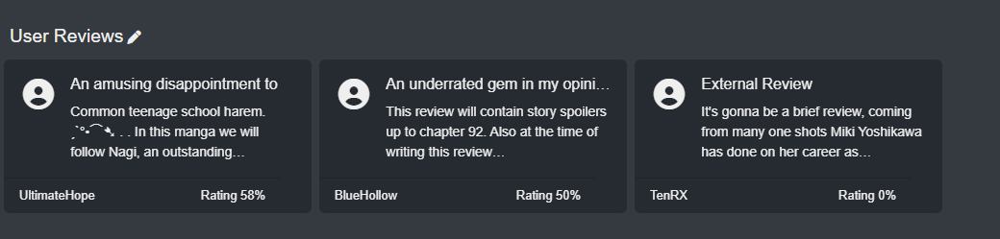
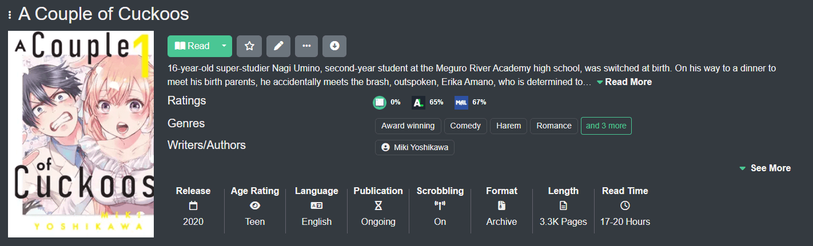

import { Callout } from 'nextra/components'

# Recommendations, Ratings & Reviews
Kavita+ will pull external reviews, recommendations, and ratings from AniList and MAL. Recommendations will show external series for admins and local series for non-admins. 

#### External Reviews
Kavita+ offers external reviews on the Series Detail page. These reviews are aggregated from multiple sources and sorted to try and provide a spectrum of positive, mid and negative reviews. 
If users on your server have opted into sharing their reviews, they will always show first, then reviews from external sources. Clicking on any review will show you the external review.

  

#### External Recommendations
Kavita+ offers external recommendations on the Series Detail page. The recommendations are aggregated from multiple sources. If the logged-in user is an admin with no age restriction, they will be able to see recommendations that are not on the server, otherwise, only series on the server will show (and the usual age restriction or library restriction will apply). 

#### External Ratings
External Ratings provides two functionalities within Kavita. First is at-a-glance average ratings from Series Detail. The second is the average rating being available for Filtering.
