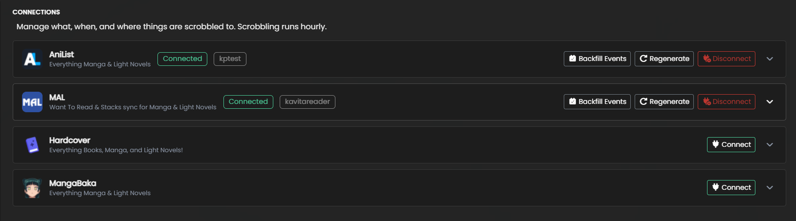
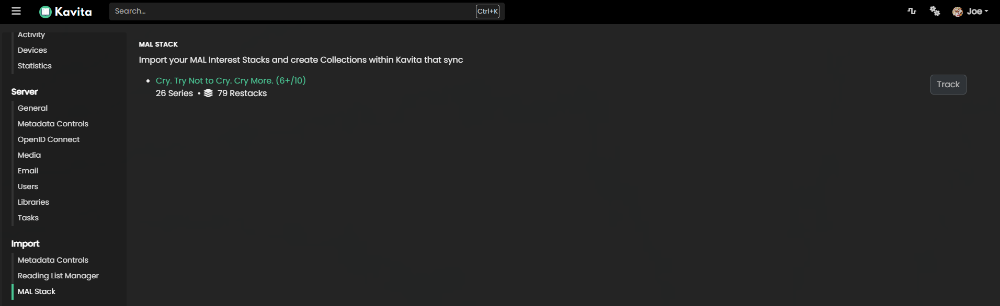
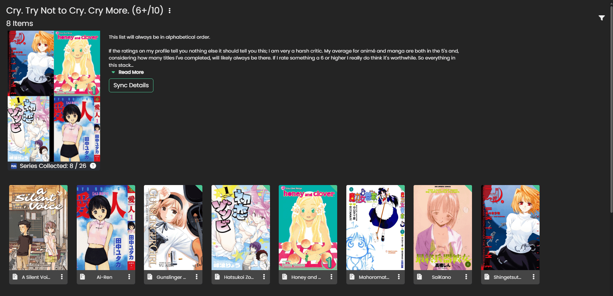

import { Callout } from 'nextra/components'

# Smart Collections
Kavita+ supports two different Smart Collections:
1. Ability to import a MAL Interest Stack and keep it synced with your Server
2. Ability to Sync your Want to Read from Scrobble Provider with your Want to Read in Kavita.

## MAL Stack Import (and sync)
Kavita+ allows any user to import their MAL stacks and restacks from their account into Kavita. Kavita will build a collection that syncs **every 2 days** with the upstream MAL stack. 

To import a stack:
1. Ensure you have setup the MAL Connection in the `Connections` page. 

2. Navigate to `Import MAL Stack` settings page. Kavita will pull all your lists, press **Track** to start tracking.

3. View the Tracked Collection.

## Want to Read sync
Kavita supports the ability to add Series to Want to Read from a user's Scrobble Provider. You can configure it on [Progress Sync](/kavita+/progress-sync) page.
