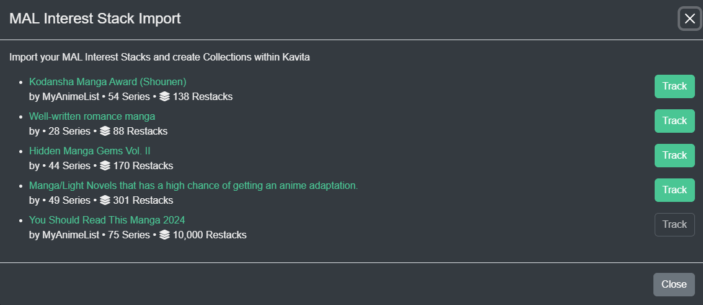

import { Callout } from 'nextra/components'

# Smart Collections
Kavita+ supports two different Smart Collections:
1. Ability to import a MAL Interest Stack and keep it synced with your Server
2. Ability to Sync your Want to Read from MAL/AniList with your Want to Read in Kavita.

#### MAL Stack Import (and sync)
Kavita+ allows any user to import their MAL stacks and restacks from their account into Kavita. Kavita will build a collection that syncs **every 2 days** with the upstream MAL stack. 

<Callout type="info">
	 Kavita will synce once every 2 days to MAL. This period is not adjustable.
</Callout>

#### Want to Read sync
Kavita supports the ability to add Series to Want to Read from a user's MAL/AniList Planned to Read list. 
